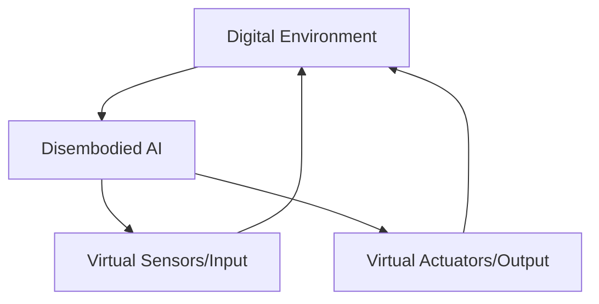
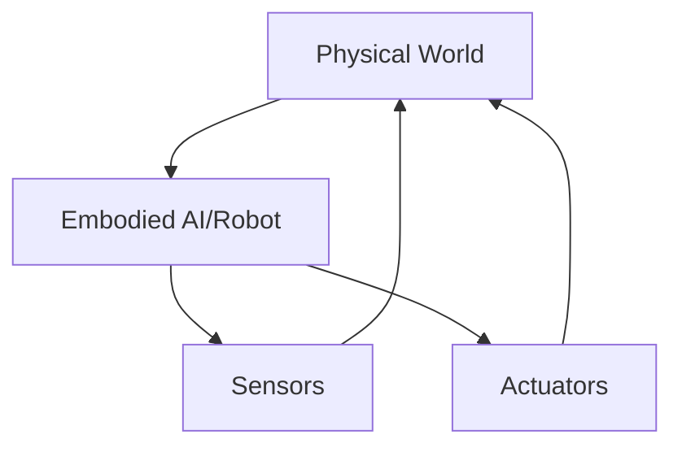
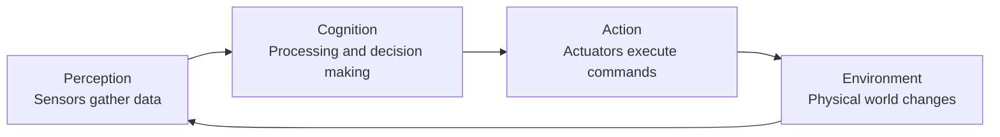

## Embodied vs. Disembodied Intelligence: Understanding the Fundamental Divide

The distinction between embodied and disembodied intelligence is fundamental to understanding Physical AI. This section explores the key differences between these two paradigms, their respective strengths and limitations, and why embodiment is crucial for creating truly intelligent machines.

### Learning Outcomes

Upon completing this section, you will be able to:

*   Differentiate between embodied and disembodied intelligence based on their operating environments and interaction modalities.
*   Identify examples of each type of intelligence and justify their classification.
*   Explain the significance of the perception-cognition-action feedback loop in embodied systems.
*   Understand why embodiment is particularly critical for humanoid robotics development.
*   Evaluate the complementary roles of both paradigms in the broader AI landscape.

### 1. Defining Embodied and Disembodied Intelligence

#### Disembodied Intelligence

Disembodied intelligence refers to AI systems that operate entirely within computational environments, without a physical form or direct interaction with the physical world. These systems process information and make decisions based solely on digital inputs and outputs.

*   **Operating Environment:** Purely digital/virtual spaces
*   **Interaction Modalities:** Virtual sensors (data streams, APIs) and virtual actuators (digital outputs, network commands)
*   **Examples:**
    *   Chatbots and virtual assistants (process text, generate text)
    *   Game-playing AI (process game states, generate moves)
    *   Recommendation systems (process user data, generate recommendations)
    *   Financial trading algorithms (process market data, generate trades)

#### Embodied Intelligence

Embodied intelligence refers to AI systems that possess a physical form (body) and interact directly with the physical world through sensors and actuators. These systems must navigate real-world physics, uncertainty, and continuous feedback between perception and action.

*   **Operating Environment:** Physical world with real-world physics and constraints
*   **Interaction Modalities:** Physical sensors (cameras, microphones, tactile sensors) and physical actuators (motors, grippers, speakers)
*   **Examples:**
    *   Autonomous vehicles (perceive roads, control steering/acceleration)
    *   Industrial robots (perceive parts, manipulate objects)
    *   Humanoid robots (perceive environment, move and interact)
    *   Drone systems (perceive airspace, control flight)

### 2. Key Differences Between Paradigms

| Aspect | Disembodied Intelligence | Embodied Intelligence |
|--------|-------------------------|----------------------|
| **Environment** | Virtual/Digital | Physical/Real-world |
| **Sensors** | Digital data feeds | Physical sensors |
| **Actuators** | Digital outputs | Physical actuators |
| **Feedback Loop** | Perception → Cognition → Action (often sequential) | Continuous perception-action loop |
| **Uncertainty** | Deterministic or modeled stochasticity | True environmental uncertainty |
| **Physics** | Abstracted or simulated | Real physical constraints |
| **Latency** | Computational delays | Sensor, processing, and actuation delays |
| **Failure Modes** | Logic errors, data issues | Physical damage, mechanical failure |

### 3. The Perception-Cognition-Action Feedback Loop

In embodied systems, the tight coupling between perception, cognition, and action creates a continuous feedback loop that is fundamental to intelligent behavior. This differs significantly from disembodied systems where these processes may be more sequential.

This feedback loop has several important implications:

*   **Continuous Learning:** The system constantly adapts based on the consequences of its actions.
*   **Real-time Adaptation:** Immediate responses to environmental changes are possible.
*   **Emergent Behaviors:** Complex behaviors can emerge from simple rules interacting with environmental constraints.
*   **Grounded Semantics:** Concepts become grounded in physical experience rather than abstract symbols.

### 4. Why Embodiment Matters for Intelligence

The concept of embodiment suggests that the body and its interactions with the environment are integral to the development of intelligence. This has profound implications for AI development:

#### 4.1. Sensorimotor Contingencies
Intelligence develops through the regularities and constraints imposed by the body's interactions with the environment. These sensorimotor contingencies shape how agents learn to perceive and act.

#### 4.2. Morphological Computation
The physical form of an embodied agent can perform computations that would otherwise require complex algorithms. For example, the passive dynamics of a walking robot's legs can simplify control algorithms.

#### 4.3. Developmental Learning
Just as human infants develop intelligence through physical exploration, embodied AI systems can benefit from developmental approaches to learning that leverage physical interaction.

### 5. Embodiment in Humanoid Robotics

Understanding embodiment is especially critical for humanoid robotics development because:

1.  **Complex Morphology:** Humanoid bodies have many degrees of freedom, creating complex control challenges that require sophisticated integration of perception, cognition, and action.

2.  **Human-like Interaction:** To interact naturally with humans and human-designed environments, humanoids must embody human-like sensorimotor patterns.

3.  **Balance and Locomotion:** The challenge of maintaining balance while moving requires tight integration between perception (of body state and environment) and action (adjustments to maintain stability).

4.  **Social Cognition:** Many aspects of human social intelligence appear to be grounded in embodied experience, making embodiment crucial for developing socially intelligent robots.

### 6. Complementary Roles

Rather than viewing embodied and disembodied intelligence as competing paradigms, it's more productive to see them as complementary:

*   **Disembodied systems** excel at processing large amounts of abstract information, performing symbolic reasoning, and optimizing complex systems.
*   **Embodied systems** excel at real-world interaction, adaptive behavior, and learning from physical experience.

Many advanced AI applications combine both approaches, using disembodied systems for high-level reasoning and planning while relying on embodied systems for execution and real-world adaptation.

---

### Review Questions

1.  What is the primary difference in the operating environment between embodied and disembodied AI systems?
2.  Provide two examples of disembodied intelligence and explain why they fall into this category.
3.  Provide two examples of embodied intelligence and explain why they fall into this category.
4.  Why is the concept of a "feedback loop between perception, cognition, and action" particularly important for embodied intelligence?
5.  In the context of humanoid robotics, why is understanding embodiment especially critical for successful development?