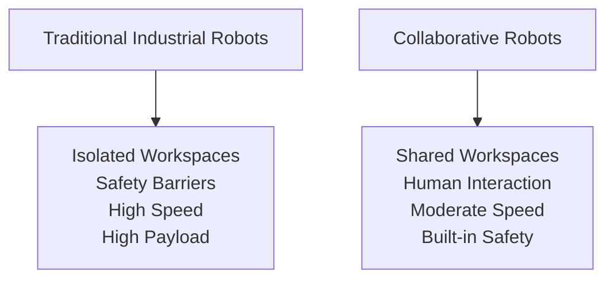
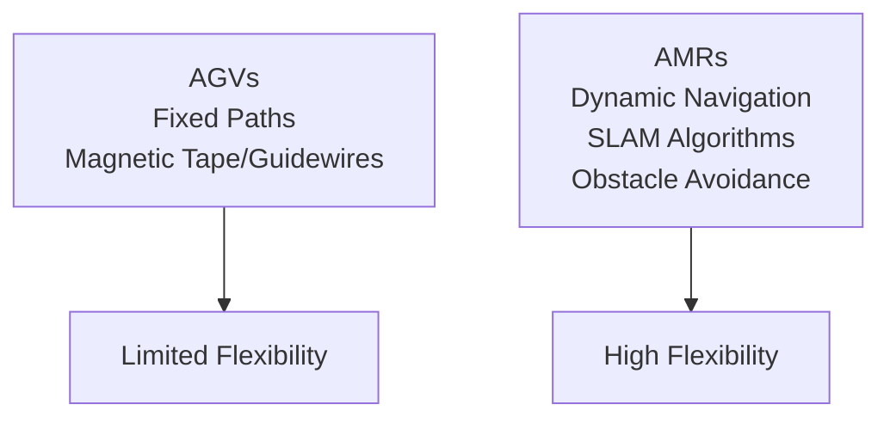

## Real-World Applications: Where Physical AI Makes a Difference

Physical AI is already transforming numerous industries and aspects of daily life. This section explores concrete applications where the integration of robotics and AI creates tangible value, from manufacturing floors to hospital rooms to the depths of space.

### Learning Outcomes

Upon completing this section, you will be able to:

*   Identify key application domains for Physical AI systems.
*   Explain how collaborative robots differ from traditional industrial robots.
*   Understand the specific benefits of Physical AI in healthcare settings.
*   Recognize why robots are particularly suited for hazardous environments.
*   Discuss the ethical implications of widespread Physical AI deployment.

### 1. Manufacturing and Industry

#### 1.1. Collaborative Robots (Cobots)
Collaborative robots represent a significant shift from traditional industrial automation:

**Key Differences:**
*   **Workspace Integration:** Cobots work alongside humans rather than in isolated cells
*   **Safety Features:** Built-in force limitation, collision detection, and soft padding
*   **Ease of Programming:** Intuitive interfaces allowing non-experts to program tasks
*   **Flexibility:** Quick redeployment for different tasks

**AI Contributions:**
*   **Computer Vision:** Object recognition and quality inspection
*   **Adaptive Control:** Adjusting to variations in part placement or orientation
*   **Predictive Maintenance:** Monitoring system health to prevent downtime

#### 1.2. Autonomous Mobile Robots (AMRs)
AMRs navigate factory floors without fixed paths, using AI for mapping and navigation:

**Capabilities:**
*   **Simultaneous Localization and Mapping (SLAM):** Building maps while tracking position
*   **Path Planning:** Finding optimal routes in dynamic environments
*   **Obstacle Avoidance:** Navigating around people, equipment, and temporary obstacles

### 2. Healthcare and Medicine

Physical AI is revolutionizing healthcare delivery through precision, consistency, and tireless operation:

#### 2.1. Surgical Robotics
Systems like the da Vinci Surgical System demonstrate advanced integration:
*   **Precision Manipulation:** Sub-millimeter accuracy surpassing human capability
*   **Minimally Invasive Access:** Smaller incisions reducing patient trauma
*   **Enhanced Visualization:** High-definition 3D imaging with digital zoom

**AI Enhancements:**
*   **Motion Scaling:** Filtering out hand tremor and scaling movements
*   **Instrument Tracking:** Monitoring tool position for safety limits
*   **Image Enhancement:** Real-time processing to highlight anatomical features

#### 2.2. Rehabilitation Robotics
Robots assist in physical therapy and recovery:
*   **Gait Training:** Exoskeletons helping stroke patients relearn walking
*   **Upper Limb Therapy:** Arm rehabilitation robots providing consistent, measurable exercises
*   **Progress Monitoring:** Quantitative assessment of recovery metrics

**AI Contributions:**
*   **Adaptive Difficulty:** Adjusting exercise intensity based on patient performance
*   **Motivational Engagement:** Gamification elements to encourage participation
*   **Personalized Protocols:** Tailoring therapy to individual patient needs

#### 2.3. Care and Assistance
Robots provide support for elderly and disabled individuals:
*   **Mobility Assistance:** Wheelchair-mounted arms for reaching and manipulation
*   **Medication Management:** Reminders and dispensing systems
*   **Companionship:** Social robots reducing isolation and cognitive decline

### 3. Exploration and Hazardous Environments

Robots excel in environments too dangerous or inaccessible for humans:

#### 3.1. Space Exploration
Mars rovers exemplify autonomous operation in extreme environments:
*   **Communication Delays:** 4-24 minute round-trip communication delay necessitates autonomy
*   **Harsh Conditions:** Extreme temperatures, radiation, dust storms
*   **Long-term Operation:** Missions lasting years with no maintenance access

**AI Capabilities:**
*   **Autonomous Navigation:** Rovers plan their own paths around obstacles
*   **Scientific Target Selection:** Identifying geologically interesting samples
*   **Fault Detection and Recovery:** Managing system failures independently

#### 3.2. Deep Sea Exploration
Underwater robots explore ocean depths with crushing pressures:
*   **Pressure Resistance:** Specialized housings protecting electronics
*   **Buoyancy Control:** Managing neutral buoyancy for stable operation
*   **Limited Communication:** Acoustic communication with low bandwidth

#### 3.3. Disaster Response
Robots enter collapsed buildings, nuclear facilities, and chemical spill sites:
*   **Size and Mobility:** Compact designs navigating confined spaces
*   **Sensor Suites:** Detecting hazardous materials and signs of life
*   **Remote Operation:** Maintaining operator safety while conducting missions

### 4. Service Industries

Physical AI is increasingly visible in everyday service applications:

#### 4.1. Hospitality and Retail
*   **Concierge Robots:** Hotel robots delivering amenities and providing information
*   **Inventory Management:** Automated systems tracking stock levels and locations
*   **Customer Service:** Receptionist robots greeting visitors and directing them

#### 4.2. Agriculture
*   **Precision Farming:** Autonomous tractors and harvesters optimizing crop yields
*   **Weeding and Spraying:** Selective treatment reducing chemical usage
*   **Monitoring:** Drones and ground robots assessing crop health

#### 4.3. Logistics and Delivery
*   **Warehouse Automation:** Sorting, picking, and packing systems
*   **Last-mile Delivery:** Ground and aerial delivery robots
*   **Inventory Tracking:** RFID and vision systems monitoring goods movement

### 5. Ethical Considerations

As Physical AI becomes more prevalent, several ethical issues require careful consideration:

#### 5.1. Employment Impact
*   **Job Displacement:** Automation replacing human workers in certain roles
*   **Skill Evolution:** Need for workforce retraining and education
*   **Economic Inequality:** Benefits concentrated among technology owners

#### 5.2. Privacy and Surveillance
*   **Data Collection:** Cameras and sensors capturing personal information
*   **Behavioral Profiling:** AI systems inferring personal characteristics
*   **Consent:** Individuals' awareness and control over collected data

#### 5.3. Safety and Liability
*   **Accident Responsibility:** Determining fault when robots cause harm
*   **Fail-Safe Design:** Ensuring graceful degradation in system failures
*   **Certification Standards:** Establishing safety requirements for different applications

#### 5.4. Human Dignity
*   **Care Relationships:** Risks of emotional attachment to artificial caregivers
*   **Decision Making:** Appropriate delegation of choices to AI systems
*   **Accessibility:** Ensuring benefits reach underserved populations

### 6. Future Outlook

The trajectory of Physical AI applications suggests continued expansion:
*   **Domestic Robots:** Home assistance for aging populations
*   **Construction Robotics:** Automated building and infrastructure maintenance
*   **Environmental Restoration:** Robots addressing climate change impacts
*   **Education and Training:** Interactive learning companions

Each application domain presents unique technical challenges and opportunities for innovation, driving continued advancement in both robotics and AI technologies.

---

### Review Questions

1.  Describe how collaborative robots (cobots) differ from traditional industrial robots in a manufacturing setting, and what role AI plays.
2.  Name two specific applications of Physical AI in healthcare and explain their benefits.
3.  Why are robots particularly valuable for exploration in hazardous environments?
4.  What are some ethical considerations that arise with the increasing deployment of Physical AI and humanoid robots?
5.  How do Autonomous Mobile Robots (AMRs) use AI to navigate complex environments?