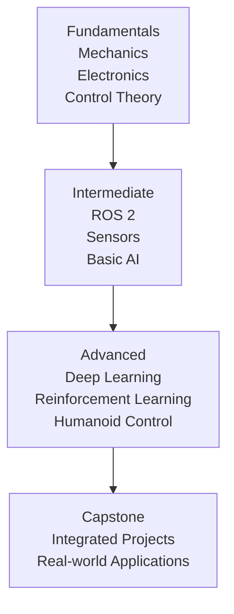

## Foundations of the Course: Your Learning Journey Begins

This textbook is designed with a unique pedagogical approach that integrates cutting-edge AI techniques with hands-on robotics experience. This section outlines the foundational elements that make this course distinctive and effective for learning Physical AI and humanoid robotics.

### Learning Outcomes

Upon completing this section, you will be able to:

*   Identify the four key elements of this textbook's pedagogical approach.
*   Recognize the core technologies emphasized throughout the course.
*   Understand how AI-native learning differs from traditional robotics education.
*   Explain the role of RAG integration in the learning process.
*   Identify the hardware platforms used for practical development.

### 1. Pedagogical Approach

Our approach to teaching Physical AI and humanoid robotics is built on four key pillars:

#### 1.1. Progressive Complexity
We scaffold learning from fundamental concepts to advanced applications:
*   **Foundation First:** Begin with core principles of mechanics, electronics, and control theory
*   **Layered Abstraction:** Gradually introduce higher-level AI concepts building on solid foundations
*   **Integration Points:** Explicitly connect concepts across domains at appropriate intervals

#### 1.2. Cross-Domain Integration
Rather than treating disciplines in isolation:
*   **Unified Framework:** Present concepts in the context of how they work together
*   **Holistic Problems:** Use projects that require integration of multiple domains
*   **Systems Thinking:** Emphasize how components interact within complex systems

#### 1.3. AI-Native Learning
Concepts are introduced with an AI-first mindset:
*   **Data-Driven Approaches:** Emphasize learning from experience over hand-coded rules
*   **Probabilistic Thinking:** Treat uncertainty as fundamental rather than exceptional
*   **Continuous Adaptation:** Design systems that improve through interaction

#### 1.4. RAG Integration
Retrieval-Augmented Generation techniques are woven throughout:
*   **Contextual Learning:** Use RAG to provide relevant background information
*   **Problem Solving:** Demonstrate how to research and synthesize solutions
*   **Documentation:** Show how to create and use knowledge bases effectively

### 2. Core Technologies

Three core technology stacks form the backbone of this course:

#### 2.1. ROS 2 (Robot Operating System 2)
The industry-standard framework for robotics development:
*   **Communication Middleware:** Standardized messaging between components
*   **Development Tools:** Visualization, debugging, and simulation capabilities
*   **Community Ecosystem:** Extensive library of existing packages and tools

#### 2.2. NVIDIA Isaac Sim
Professional-grade robotics simulation:
*   **Photorealistic Rendering:** High-fidelity visual environments
*   **Physics Simulation:** Accurate modeling of robot dynamics and interactions
*   **AI Framework Integration:** Seamless connection to deep learning workflows

#### 2.3. Qdrant Vector Database
Specialized database for similarity search and RAG:
*   **Vector Storage:** Efficient storage and retrieval of high-dimensional embeddings
*   **Semantic Search:** Find relevant information based on meaning rather than keywords
*   **Scalability:** Handle large knowledge bases with low-latency queries

### 3. Hardware Platforms

Hands-on experience is crucial for mastering Physical AI:

#### 3.1. NVIDIA Jetson Series
Edge AI computing platforms:
*   **Jetson Nano:** Entry-level development with CUDA acceleration
*   **Jetson Xavier NX:** Mid-tier performance for complex applications
*   **Jetson AGX Orin:** High-performance platform for demanding robotics tasks

**Key Features:**
*   **ARM Architecture:** Power-efficient processing
*   **CUDA Cores:** Parallel processing for AI workloads
*   **Real-time Capabilities:** Deterministic execution for control systems

#### 3.2. Robot Platforms
Physical robots for hands-on experimentation:
*   **TurtleBot 4:** Mobile robot platform for navigation and SLAM
*   **Lynxmotion AL5D:** Desktop robotic arm for manipulation tasks
*   **Custom Humanoid Kits:** Specialized platforms for bipedal locomotion

### 4. Learning Environment

#### 4.1. Simulation-First Approach
Begin concepts in simulation before physical deployment:
*   **Safe Experimentation:** Test ideas without risk of damage
*   **Rapid Iteration:** Quickly modify and retest approaches
*   **Scalable Scenarios:** Test in diverse environments easily

#### 4.2. Cloud Integration
Leverage cloud resources for demanding computations:
*   **Training Infrastructure:** Access to powerful GPUs for deep learning
*   **Data Storage:** Large datasets and model repositories
*   **Collaboration:** Shared environments for team projects

#### 4.3. Version Control and Documentation
Professional development practices:
*   **Git Workflows:** Track changes and collaborate effectively
*   **Documentation Standards:** Create maintainable, understandable code
*   **Testing Frameworks:** Ensure reliability and reproducibility

### 5. Assessment Philosophy

Evaluation emphasizes practical competence over theoretical memorization:

#### 5.1. Project-Based Learning
Demonstrate mastery through comprehensive projects:
*   **Portfolio Development:** Build a showcase of capabilities
*   **Real-World Relevance:** Solve authentic problems with practical constraints
*   **Iterative Improvement:** Refine solutions based on feedback and testing

#### 5.2. Peer Collaboration
Learn through teaching and teamwork:
*   **Code Reviews:** Practice giving and receiving constructive feedback
*   **Pair Programming:** Share knowledge and catch errors early
*   **Group Projects:** Develop collaboration and leadership skills

#### 5.3. Continuous Integration
Apply professional development practices:
*   **Automated Testing:** Ensure code quality and functionality
*   **Deployment Pipelines:** Practice release management
*   **Performance Monitoring:** Learn to optimize and debug systems

### 6. Resources and Support

#### 6.1. Online Materials
Comprehensive digital resources:
*   **Video Lectures:** Visual explanations of complex concepts
*   **Interactive Notebooks:** Hands-on coding exercises with immediate feedback
*   **Reference Documentation:** Detailed guides for tools and techniques

#### 6.2. Community Engagement
Connect with peers and experts:
*   **Discussion Forums:** Ask questions and share insights
*   **Office Hours:** Direct interaction with instructors
*   **Guest Lectures:** Insights from industry practitioners

#### 6.3. Career Preparation
Bridge from education to employment:
*   **Portfolio Development:** Create impressive demonstration projects
*   **Interview Preparation:** Practice technical and behavioral questions
*   **Industry Connections:** Networking opportunities with potential employers

This foundation prepares you for the exciting journey ahead in Physical AI and humanoid robotics, equipping you with both the theoretical knowledge and practical skills needed to succeed in this rapidly evolving field.

---

### Review Questions

1.  What are the four key elements of the pedagogical approach used in this textbook?
2.  Name three core technologies that are central to this course's curriculum.
3.  How does the textbook's design support "AI-native learning" and RAG integration?
4.  What type of database is Qdrant used for in this course, and what is its role?
5.  Beyond simulation, what hardware platforms does this course introduce for practical robotics development?