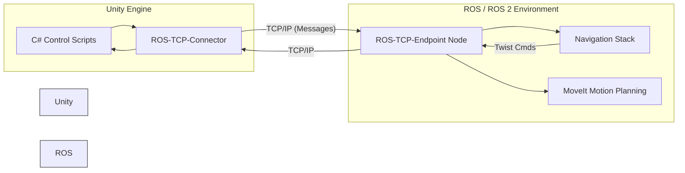

import Mermaid from '@theme/Mermaid';

## Learning Outcomes

After completing this section, you will be able to:
- Explain what the Unity Robotics Hub is and its role in the robotics ecosystem.
- Understand the architecture of the Unity-ROS communication bridge.
- Install and configure the necessary Unity packages for robotics (URDF Importer, ROS-TCP-Connector).
- Set up a Unity project specifically for humanoid robot simulation.
- Describe the advantages of using Unity over other simulators for specific use cases like HRI and vision.

## 1. What is Unity Robotics Hub?

The **Unity Robotics Hub** is a collection of open-source tools, packages, and learning resources maintained by Unity Technologies to enable robotics simulation. It effectively turns the Unity Game Engine—known for its ease of use, cross-platform deployment, and stunning visuals—into a powerful robotics simulator.

For **physical AI and humanoids**, Unity offers distinct advantages:
-   **Visual Fidelity:** Best-in-class rendering for simulating cameras in complex, visually rich environments (homes, outdoor scenes).
-   **PhysX 4.x / Articulation Bodies:** Unity's integration of PhysX specifically exposes "Articulation Bodies," a physics component designed for high-fidelity joint simulation of robot chains, crucial for stable humanoid locomotion.
-   **ML-Agents:** A mature toolkit for training Reinforcement Learning (RL) agents directly within Unity, enabling complex motion generation learning.
-   **Human-Robot Interaction:** Unity's strength in character animation makes it ideal for simulating humans *interacting* with robots, allowing for safe testing of social navigation and collaboration.

## 2. Key Components

The Robotics Hub ecosystem primarily consists of:

### 2.1 ROS-TCP-Connector & ROS-TCP-Endpoint
This is the communication bridge.
-   **In Unity:** The `ROS-TCP-Connector` is a C# package that sends/receives messages.
-   **In ROS:** The `ROS-TCP-Endpoint` is a ROS node (Python) that runs along with your ROS graph.
-   **Protocol:** They communicate over standard TCP/IP. Unity serializes C# structs into ROS message byte streams, and the Endpoint deserializes them into ROS messages (and vice versa).

### 2.2 URDF Importer
A Unity Editor tool that parses standard URDF (Unified Robot Description Format) files and automatically generates Unity GameObjects with the correct:
-   **Articulation Bodies:** For physics and joints.
-   **Meshes:** Imports visual and collision geometry.
-   **Hierarchy:** Preserves the link/joint tree structure.

### 2.3 Visualizations Package
Provides Unity components to visualize ROS topics directly in the Scene:
-   Laser scans
-   Point clouds
-   Occupancy grids
-   Trajectories
This is essentially "RViz inside Unity."

:::tip Diagram Suggestion: Unity-ROS Bridge
A diagram showing the flow of data between Unity and ROS via the TCP connector.


:::

## 3. Installation and Setup

### 3.1 Prerequisites
-   **Unity Hub & Editor:** Install Unity 2020.3 LTS or later (2021.3+ Recommended).
-   **ROS 2:** Foxy, Galactic, or Humble installed on your machine (or in a Docker container).

### 3.2 Setting Up the Unity Project
1.  **Create Project:** Open Unity Hub -> New Project -> "3D" (or "3D (URP)" for better graphics).
2.  **Open Package Manager:** `Window -> Package Manager`.
3.  **Add via Git URL:** Click the `+` icon -> "Add package from git URL".
    -   **URDF Importer:** `https://github.com/Unity-Technologies/URDF-Importer.git?path=/com.unity.robotics.urdf-importer`
    -   **ROS-TCP-Connector:** `https://github.com/Unity-Technologies/ROS-TCP-Connector.git?path=/com.unity.robotics.ros-tcp-connector`

### 3.3 Setting Up the ROS Side
1.  **Clone Endpoint:** In your ROS 2 workspace `src` folder:
    ```bash
    git clone https://github.com/Unity-Technologies/ROS-TCP-Endpoint
    ```
2.  **Build:** `colcon build --packages-select ros_tcp_endpoint`
3.  **Source:** `source install/setup.bash`
4.  **Configure IP:** Ensure the ROS Endpoint knows Unity's IP (usually `127.0.0.1` if local).

## 4. Why Use Unity for Humanoids?

While Gazebo and Isaac Sim are powerful, Unity shines in **accessibility** and **HRI**.
-   **Asset Store:** You can buy or download thousands of realistic 3D environments (offices, cities) and props for a few dollars, rapidly assembling test scenes.
-   **Virtual Reality (VR):** You can easily stream the robot's camera to a VR headset or control the robot using VR controllers for teleoperation data collection.
-   **Digital Humans:** Unity's "Digital Human" packages allow for simulating realistic looking people, which is critical if your humanoid robot's main job is to work alongside us.

## 5. Exercises

1.  **Project Init:** Create a completely new Unity Project named `HumanoidSim_Unity`.
2.  **Package Install:** Successfully install the `URDF Importer` and `ROS-TCP-Connector` packages. Verify no errors appear in the Unity Console.
3.  **Menu Explorer:** Locate the new menu items added by these packages (`Robotics -> URDF Import`, `Robotics -> ROS Settings`).
4.  **Connection Test:**
    -   Start the ROS TCP Endpoint in a terminal: `ros2 run ros_tcp_endpoint default_server_endpoint`
    -   In Unity, go to `Robotics -> ROS Settings` and check the connection status. It should turn green/say "Connected" when you enter Play Mode.

## 6. Review Questions

1.  What is the primary function of the **ROS-TCP-Connector** in the Unity Robotics architecture?
2.  Does the Unity Robotics Hub use standard Rigidbody physics or a specialized component for robots? What is it called?
3.  List two advantages of using Unity for humanoid simulation compared to a traditional simulator like standard Gazebo.
4.  What Unity tool allows you to bring a robot description file directly into the editor without manually assembling parts?
5.  True or False: The ROS-TCP-Endpoint runs inside the Unity Editor. (False, it runs in the ROS environment).
