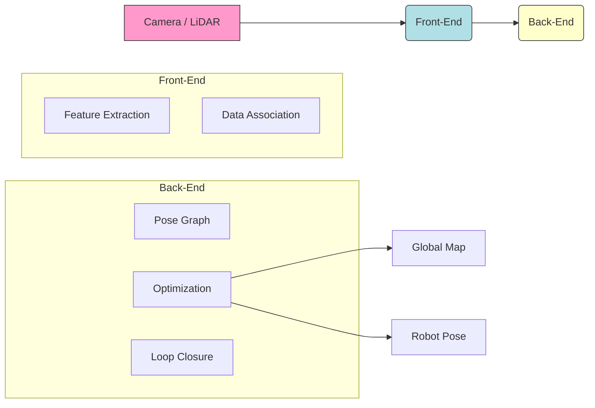

import Mermaid from '@theme/Mermaid';

## Learning Outcomes

After completing this section, you will be able to:
- Define what SLAM (Simultaneous Localization and Mapping) is and why it is a fundamental problem in robotics.
- Explain the "Chicken and Egg" problem inherent in SLAM.
- Identify the core components of a SLAM system: Front-end (Data Association) and Back-end (Optimization).
- Distinguish between Visual SLAM (vSLAM) and LiDAR-based SLAM.
- Discuss the specific challenges of implementing SLAM on a humanoid robot (e.g., camera motion, lack of odometry).

## 1. The "Chicken and Egg" Problem

**SLAM** stands for **Simultaneous Localization and Mapping**. It addresses the question: *How can a robot build a map of an unknown environment while simultaneously tracking its own position within that map?*

This is circular because:
1.  To build an accurate map, the robot needs to know exactly where it is (**Localization**).
2.  To know exactly where it is, the robot needs an accurate map to reference (**Mapping**).

SLAM algorithms solve this by iteratively refining both estimates (position and map) based on sensor data and motion constraints.

## 2. Why is SLAM Crucial for Humanoids?

For a humanoid robot, SLAM is not just about drawing a floor plan. It is about:
-   **Semantic Understanding:** Knowing "I am in the kitchen" vs. "I am in the hallway."
-   **Object Interaction:** Locating objects (cups, doors) relative to itself to interact with them.
-   **Loop Closure:** Recognizing "I have been here before" to correct the accumulating drift in its internal position estimate.
-   **Dynamic Environments:** Unlike an AGV in a warehouse, humanoids work in messy, changing homes. The map must update.

## 3. Core Components of a SLAM System

Most modern SLAM systems are divided into two main parts: the **Front-End** and the **Back-End**.

### 3.1 The Front-End (Visual Odometry / Tracking)
The Front-End processes raw sensor data (images, scans) to extract information and estimate immediate motion.
-   **Feature Extraction:** Finding distinctive points in an image (corners, edges).
-   **Feature Matching:** Finding the same points in the *next* image.
-   **Motion Estimation:** Calculating how much the camera moved based on how the points moved.
-   **Output:** A "Trajectory" guess and a "Local Map."

### 3.2 The Back-End (Optimization)
The Back-End takes the Front-End's noisy guesses and cleans them up mathematically using **Graph Optimization** (e.g., Pose Graph Optimization, Bundle Adjustment).
-   **Input:** The trajectory and landmarks constraints.
-   **Loop Closure Detection:** If the robot sees a familiar place, the Back-End "snaps" the map together, distributing the accumulated error across the whole path.
-   **Output:** A globally consistent Map and Trajectory.

:::tip Diagram Suggestion: SLAM Pipeline
A simplified flow of a SLAM system.

:::

## 4. Types of SLAM

### 4.1 Visual SLAM (vSLAM)
Uses cameras (Mono, Stereo, RGB-D).
-   **Pros:** Rich information (color, texture), inexpensive sensors. Humanoids "see" like we do, so vSLAM is natural.
-   **Cons:** Sensitive to lighting, motion blur, and lack of texture (white walls).

### 4.2 LiDAR SLAM
Uses Laser Range Finders (2D or 3D).
-   **Pros:** Extremely accurate distance measurements, works in the dark.
-   **Cons:** Expensive, heavy, sparse vertical information (for 2D LiDAR), no color/texture info.

For humanoids, **Visual-Inertial SLAM (VINS)** is the gold standard. It combines a **Camera** (Vision) with an **IMU** (Inertial Measurement Unit). The IMU provides fast, robust motion sensing (good for when the robot shakes or fails to see features), and the Camera corrects the IMU's drift.

## 5. Exercises

1.  **Conceptual Challenge:** Imagine you are dropped in a dark, unfamiliar forest with a flashlight and a notepad. Describe the steps you would take to duplicate what a SLAM algorithm does. How do you "Localize" and "Map"? What is your "Loop Closure" event?
2.  **Tool Exploration:** Research **ORB-SLAM3**. Is it a Front-end, Back-end, or complete system? What sensors does it support?
3.  **Sensor Analysis:** Why might a humanoid robot struggling to walk (vibrating/shaking) have a harder time with pure Visual SLAM than a wheeled robot? How does an IMU help?

## 6. Review Questions

1.  Explain the "Loop Closure" problem in your own words. Why is it necessary?
2.  What is the main responsibility of the "Back-end" in a SLAM system?
3.  If a robot is in a completely featureless white room, which sensor would fail: LiDAR or Camera? Why?
4.  What does the acronym **VINS** stand for, and why is it popular for aerial drones and humanoids?
5.  True or False: Generating a map is the *only* goal of SLAM. (False, Localization is equally important).
