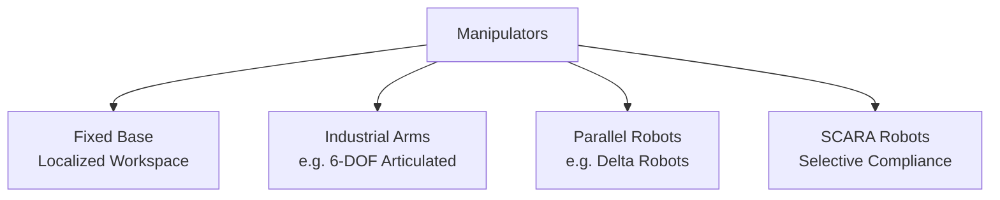
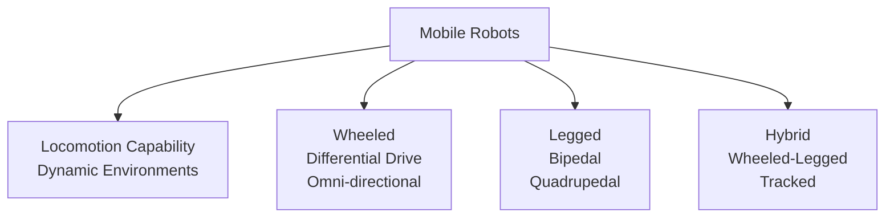
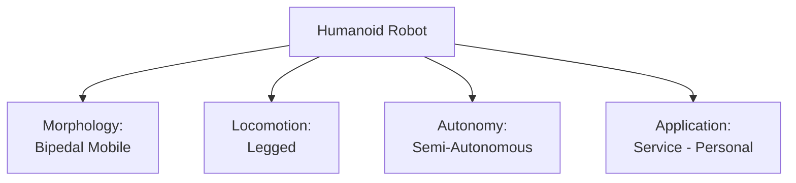

## Robotics Taxonomy: Classifying Robotic Systems

Understanding the diverse landscape of robotic systems requires a systematic classification approach. This section introduces a comprehensive taxonomy that categorizes robots based on morphology, locomotion, autonomy, and application domain.

### Learning Outcomes

Upon completing this section, you will be able to:

*   Classify robots according to morphological characteristics.
*   Distinguish between different locomotion mechanisms.
*   Differentiate between autonomy levels in robotic systems.
*   Identify robots by their application domains.
*   Understand how multiple classification criteria can be combined.

### 1. Morphological Classification

Morphology refers to the physical form and structure of a robot. The primary morphological distinction is between manipulators and mobile robots:

#### 1.1. Manipulators
Manipulators are robots with a fixed base that operate within a localized workspace:

*   **Characteristics:**
    *   Fixed base attached to a structure
    *   Operate within a defined workspace
    *   High precision and repeatability
    *   Optimized for speed and payload capacity

*   **Common Examples:**
    *   Industrial articulated arms (6-DOF)
    *   SCARA robots (Selective Compliance Assembly Robot Arm)
    *   Delta robots (Parallel kinematics for high-speed pick-and-place)

#### 1.2. Mobile Robots
Mobile robots have locomotion capabilities that allow them to move through environments:

*   **Characteristics:**
    *   Mobility through various terrains
    *   Dynamic interaction with environments
    *   Navigation and path planning capabilities
    *   Sensing and mapping of surroundings

### 2. Locomotion Classification

Based on how robots move through their environment:

#### 2.1. Wheeled Robots
Most common due to simplicity and efficiency on flat surfaces:

*   **Differential Drive:** Two independently controlled wheels
*   **Ackermann Steering:** Car-like steering mechanism
*   **Omni-directional:** Multiple wheels allowing movement in any direction
*   **Tracked:** Continuous tracks for rough terrain traversal

#### 2.2. Legged Robots
More complex but offer superior mobility in challenging terrains:

*   **Bipedal:** Two legs (humanoid robots)
*   **Quadrupedal:** Four legs (dog-like robots)
*   **Hexapodal:** Six legs (insect-inspired robots)
*   **Multipedal:** More than six legs

#### 2.3. Hybrid Systems
Combination approaches for specialized applications:

*   **Wheeled-Legged:** Wheels for efficiency, legs for obstacle crossing
*   **Tracked:** Continuous tracks for rough terrain
*   **Aerial:** Flying robots (drones, ornithopters)

### 3. Autonomy Classification

Based on the level of human involvement in operation:

#### 3.1. Teleoperated Robots
Direct human control through interfaces:

*   **Characteristics:**
    *   Continuous human input required
    *   Operator controls all major decisions
    *   May include safety features or basic automation

*   **Applications:**
    *   Surgical robots
    *   Bomb disposal robots
    *   Remote exploration vehicles

#### 3.2. Semi-Autonomous Robots
Combination of human oversight and automated functions:

*   **Characteristics:**
    *   Autonomous execution of routine tasks
    *   Human intervention for complex decisions
    *   Supervisory control interface

*   **Applications:**
    *   Autonomous vehicles with manual override
    *   Warehouse robots with human coordination
    *   Agricultural robots with periodic supervision

#### 3.3. Autonomous Robots
Independent operation with minimal human intervention:

*   **Characteristics:**
    *   Self-contained decision making
    *   Environmental perception and interpretation
    *   Goal-directed behavior planning

*   **Applications:**
    *   Domestic cleaning robots
    *   Delivery robots
    *   Space exploration rovers

### 4. Application Domain Classification

Classification based on intended use cases:

#### 4.1. Industrial Robots
Designed for manufacturing and production environments:

*   **Characteristics:**
    *   High precision and repeatability
    *   Structured environments
    *   Optimized for specific tasks
    *   Safety barriers typically required

*   **Examples:**
    *   Welding robots
    *   Painting robots
    *   Assembly line robots

#### 4.2. Service Robots
Interact with humans in various environments:

*   **Professional Service Robots:**
    *   Healthcare assistance robots
    *   Security patrol robots
    *   Maintenance robots

*   **Personal Service Robots:**
    *   Domestic cleaning robots
    *   Entertainment robots
    *   Educational robots

#### 4.3. Research Robots
Platforms for advancing robotic technologies:

*   **Characteristics:**
    *   Modular and customizable
    *   Extensive sensor suites
    *   Open software architectures
    *   Designed for experimentation

### 5. Integrated Taxonomy Example

A complete classification combines multiple criteria:

For example, a humanoid robot:
*   **Morphology:** Bipedal mobile robot
*   **Locomotion:** Legged
*   **Autonomy:** Semi-autonomous
*   **Application:** Personal service robot

### 6. Emerging Categories

New classifications are emerging with technological advances:

#### 6.1. Swarm Robots
Collective systems of simple robots working together:

*   **Characteristics:**
    *   Distributed intelligence
    *   Simple individual robots
    *   Complex emergent behaviors

#### 6.2. Soft Robots
Constructed from compliant materials:

*   **Characteristics:**
    *   Deformable structures
    *   Safe human interaction
    *   Biomimetic capabilities

#### 6.3. Modular Robots
Reconfigurable systems composed of interchangeable modules:

*   **Characteristics:**
    *   Adaptive morphology
    *   Self-reconfiguration capabilities
    *   Versatile functionality

Understanding these taxonomies provides a framework for analyzing existing robots and designing new ones. Each classification dimension influences design choices, component selection, and algorithm development.

---

### Review Questions

1.  What is the primary difference between a manipulator and a mobile robot based on morphology?
2.  Name three types of legged robots and their respective number of legs.
3.  How does an autonomous robot differ from a teleoperated robot in terms of control?
4.  Give an example of a professional service robot and a personal service robot.
5.  If a robot uses tracks for movement and is designed for military applications, how would you classify it based on locomotion and application area?