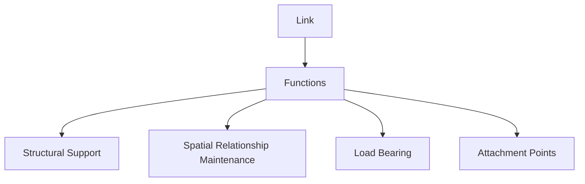
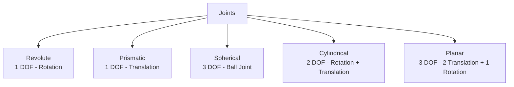
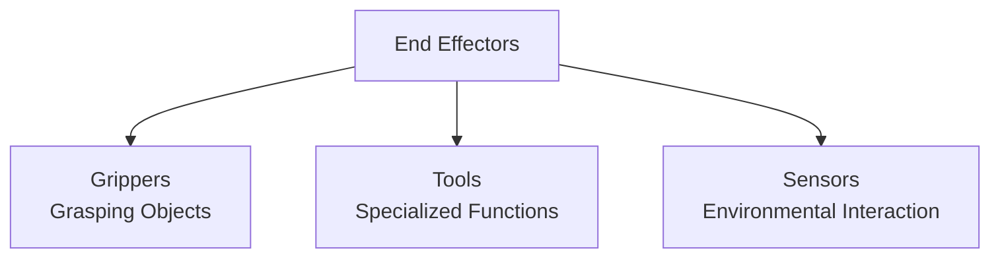
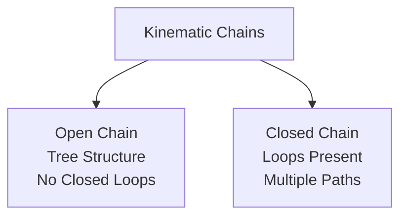

## Mechanical Structure of Robots: The Foundation of Movement

The mechanical structure of a robot forms the physical foundation that enables movement, manipulation, and interaction with the environment. This section explores the fundamental components that make up robotic mechanical systems, from basic links and joints to complex kinematic chains and end effectors.

### Learning Outcomes

Upon completing this section, you will be able to:

*   Identify and describe the basic mechanical components of robots: links, joints, and end effectors.
*   Understand different types of joints and their degrees of freedom.
*   Differentiate between open and closed kinematic chains.
*   Analyze the relationship between mechanical structure and robot capabilities.
*   Evaluate the design trade-offs in robotic mechanical systems.

### 1. Basic Mechanical Components

#### 1.1. Links
Links are the rigid bodies that connect joints in a robot. They serve as the structural elements that maintain the spatial relationships between joints.

*   **Functions:**
    *   **Structural Support:** Maintain the robot's shape and integrity
    *   **Spatial Relationship Maintenance:** Define the geometry between joints
    *   **Load Bearing:** Transfer forces and torques between joints
    *   **Attachment Points:** Provide mounting locations for sensors, actuators, and other components

*   **Design Considerations:**
    *   **Material Selection:** Strength-to-weight ratio, cost, manufacturability
    *   **Geometry Optimization:** Hollow structures for weight reduction
    *   **Manufacturing Method:** Machining, casting, 3D printing
    *   **Integration Features:** Cable routing, mounting holes

#### 1.2. Joints
Joints are the connections between links that allow relative motion. They define the robot's degrees of freedom and kinematic behavior.

*   **Types of Joints:**

    *   **Revolute Joint (Rotary):**
        *   **Degrees of Freedom:** 1 (rotation about an axis)
        *   **Motion Type:** Angular displacement
        *   **Common Examples:** Servo motors, stepper motors
        *   **Applications:** Most common in articulated robots

    *   **Prismatic Joint (Linear):**
        *   **Degrees of Freedom:** 1 (translation along an axis)
        *   **Motion Type:** Linear displacement
        *   **Common Examples:** Linear actuators, hydraulic cylinders
        *   **Applications:** Cartesian robots, some grippers

    *   **Spherical Joint (Ball):**
        *   **Degrees of Freedom:** 3 (rotation about three perpendicular axes)
        *   **Motion Type:** Three-dimensional rotation
        *   **Common Examples:** Ball joints, universal joints
        *   **Applications:** Wrist mechanisms, vehicle suspensions

    *   **Cylindrical Joint:**
        *   **Degrees of Freedom:** 2 (rotation and translation about the same axis)
        *   **Motion Type:** Helical motion
        *   **Common Examples:** Screw-nut mechanisms
        *   **Applications:** Specialized robotic mechanisms

    *   **Planar Joint:**
        *   **Degrees of Freedom:** 3 (two translations in a plane and one rotation about the normal)
        *   **Motion Type:** Planar motion
        *   **Common Examples:** Sliding mechanisms on a flat surface
        *   **Applications:** XY tables, planar robots

#### 1.3. End Effectors
End effectors are the terminal devices attached to the robot's last link that interact directly with the environment or workpiece.

*   **Types of End Effectors:**

    *   **Grippers:**
        *   **Parallel Jaw Grippers:** Two opposing jaws for simple grasping
        *   **Three-Finger Grippers:** More dexterous grasping capabilities
        *   **Vacuum Grippers:** Use suction for handling flat or smooth objects
        *   **Magnetic Grippers:** Handle ferromagnetic materials

    *   **Specialized Tools:**
        *   **Welding Torches:** For automated welding operations
        *   **Paint Sprayers:** For consistent coating applications
        *   **Sanding Tools:** For surface finishing operations
        *   **Drill Bits:** For precision hole drilling

    *   **Sensors:**
        *   **Force/Torque Sensors:** Measure interaction forces
        *   **Tactile Sensors:** Provide touch feedback
        *   **Proximity Sensors:** Detect nearby objects

### 2. Degrees of Freedom and Kinematics

#### 2.1. Degrees of Freedom (DOF)
The number of independent parameters that define the configuration of a mechanical system.

*   **Serial Chain Robots:** DOF = Sum of individual joint DOFs
*   **Redundant Robots:** More DOF than required for a task
*   **Constraint Robots:** Fewer DOF than general workspace dimensions

#### 2.2. Kinematic Chains
The arrangement of links and joints determines the robot's kinematic properties:

*   **Open Kinematic Chains:**
    *   **Structure:** Tree-like arrangement with no closed loops
    *   **Advantages:** Simple forward and inverse kinematics
    *   **Examples:** Most industrial robotic arms
    *   **Workspace:** Generally larger and more accessible

*   **Closed Kinematic Chains:**
    *   **Structure:** Loops formed by multiple connection paths
    *   **Advantages:** Higher structural rigidity, better load distribution
    *   **Examples:** Parallel robots (Delta robots), leg mechanisms
    *   **Challenges:** Complex kinematics, singularities

### 3. Design Considerations

#### 3.1. Workspace Analysis
The mechanical structure directly determines the robot's reachable workspace:

*   **Reach Envelope:** Volume of space the end effector can access
*   **Dexterity:** Quality of movement within the workspace
*   **Singularity Points:** Configurations where DOF is temporarily reduced

#### 3.2. Structural Integrity
Mechanical design must withstand operational forces:

*   **Static Loads:** Weight of components and payload
*   **Dynamic Loads:** Acceleration and deceleration forces
*   **External Forces:** Interaction forces with environment
*   **Fatigue Considerations:** Repeated loading cycles

#### 3.3. Actuation Integration
Mechanical design must accommodate actuators:

*   **Mounting Points:** Secure attachment locations
*   **Space Allocation:** Room for motors, gearboxes, and drive mechanisms
*   **Heat Dissipation:** Ventilation for thermal management
*   **Maintenance Access:** Easy access for servicing

### 4. Humanoid Robot Specifics

Humanoid robots present unique mechanical challenges:

#### 4.1. Anthropomorphic Design
Mimicking human anatomy while meeting engineering requirements:

*   **Head and Neck:** Pan-tilt mechanism for vision systems
*   **Torso:** Flexible spine for balance and natural movement
*   **Arms:** 7+ DOF for dexterous manipulation
*   **Legs:** Complex kinematics for bipedal locomotion

#### 4.2. Balance and Stability
Unique challenges for bipedal systems:

*   **Center of Mass:** Dynamic control for balance
*   **Foot Design:** Ankle mechanisms for stability
*   **Whole-Body Coordination:** Integrated control of all joints

### 5. Material and Manufacturing Considerations

#### 5.1. Material Selection
Trade-offs between different material properties:

*   **Metals:** High strength, good wear resistance, heavier
*   **Plastics:** Lightweight, cost-effective, lower strength
*   **Composites:** High strength-to-weight ratio, specialized properties
*   **Ceramics:** High stiffness, wear resistance, brittleness

#### 5.2. Manufacturing Methods
Different approaches for producing robot components:

*   **Machining:** High precision, suitable for small quantities
*   **Casting:** Cost-effective for complex shapes in large quantities
*   **3D Printing:** Rapid prototyping, complex geometries
*   **Sheet Metal Fabrication:** Lightweight structures

The mechanical structure forms the foundation upon which all other robotic systems are built. A well-designed mechanical system provides the platform for precise control, reliable operation, and effective interaction with the environment.

---

### Review Questions

1.  What is the primary function of a "link" in a robot's mechanical structure?
2.  How many degrees of freedom does a revolute joint typically have, and what kind of motion does it allow?
3.  Describe the difference between an open and a closed kinematic chain.
4.  Provide two examples of end effectors and the tasks they are designed for.
5.  Why is a high degree of freedom often desirable in humanoid robots?