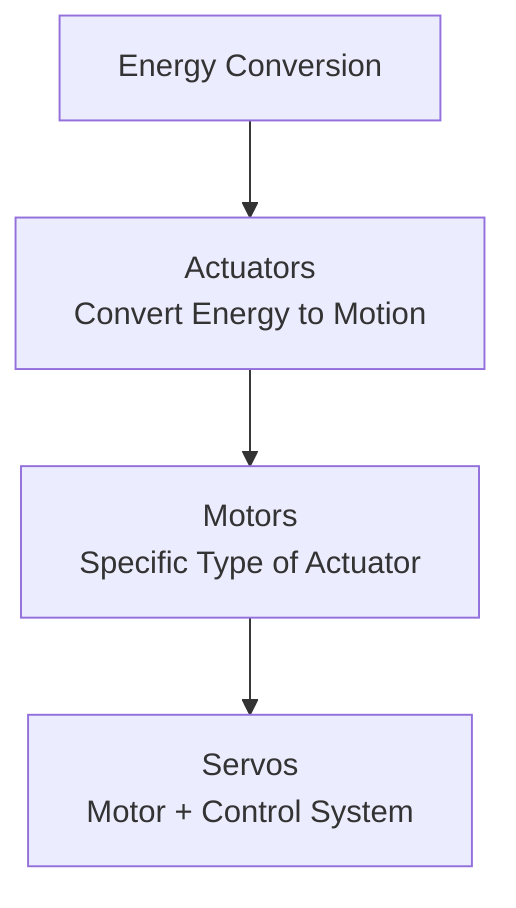
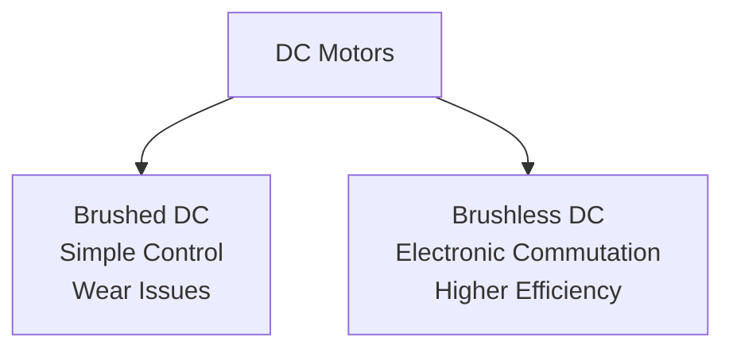
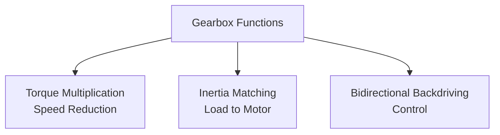
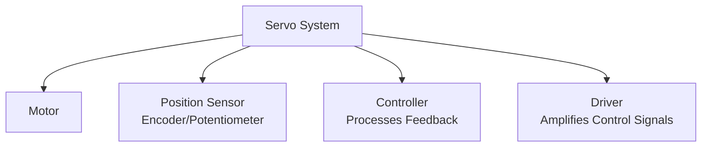

## Motors, Actuators, and Servos: Powering Robotic Motion

Actuators are the muscles of robotic systems, converting energy into mechanical motion. This section explores the diverse range of actuation technologies used in robotics, from simple DC motors to sophisticated servo systems, examining their characteristics, applications, and selection criteria.

### Learning Outcomes

Upon completing this section, you will be able to:

*   Distinguish between motors, actuators, and servos and understand their relationships.
*   Compare different types of electric motors and their suitability for various robotic applications.
*   Understand the role of gearboxes and transmission systems in robotic actuation.
*   Evaluate alternative actuation technologies including hydraulic and pneumatic systems.
*   Select appropriate actuation systems based on application requirements.

### 1. Fundamentals of Actuation

#### 1.1. Definitions and Relationships

*   **Actuator:** A general term for any device that converts energy (electrical, hydraulic, pneumatic) into mechanical motion.
*   **Motor:** A specific type of actuator that converts electrical energy into rotational mechanical energy.
*   **Servo:** A motor combined with a control system that provides precise position, velocity, or torque control.

#### 1.2. Key Performance Parameters

When selecting actuators, several key parameters must be considered:

*   **Torque:** Rotational force output (Nm)
*   **Speed:** Rotational velocity (RPM)
*   **Power:** Product of torque and speed (W)
*   **Efficiency:** Ratio of mechanical output to electrical input
*   **Precision:** Accuracy of position or speed control
*   **Response Time:** How quickly the actuator responds to commands
*   **Durability:** Expected lifespan under operating conditions

### 2. Electric Motors

Electric motors are the most common type of actuator in robotics due to their cleanliness, controllability, and efficiency.

#### 2.1. DC Motors

*   **Brushed DC Motors:**
    *   **Operation:** Current flows through brushes to commutator segments, creating rotating magnetic fields
    *   **Advantages:**
        *   Simple and inexpensive control
        *   Good torque at low speeds
        *   Easy speed control through voltage variation
    *   **Disadvantages:**
        *   Brush wear requiring maintenance
        *   Electrical noise from commutation
        *   Limited lifespan due to brush wear
    *   **Applications:** Low-cost hobby robots, simple mechanisms

*   **Brushless DC (BLDC) Motors:**
    *   **Operation:** Electronic commutation using position sensors or sensorless techniques
    *   **Advantages:**
        *   No brush wear, longer lifespan
        *   Higher efficiency and power density
        *   Better speed control and dynamic response
        *   Less electrical noise
    *   **Disadvantages:**
        *   More complex and expensive control electronics
        *   Requires position feedback
    *   **Applications:** High-performance robots, drones, precision machinery

#### 2.2. Stepper Motors

Stepper motors move in discrete steps, making them ideal for open-loop position control:

*   **Operation:** Electromagnetic coils are energized in sequence to move the rotor in precise increments
*   **Advantages:**
    *   Precise open-loop position control
    *   High holding torque when powered
    *   Good repeatability
*   **Disadvantages:**
    *   Resonance issues at certain speeds
    *   Lower efficiency due to constant current draw
    *   Can lose synchronization under overload
*   **Applications:** 3D printers, CNC machines, precision positioning systems

#### 2.3. AC Motors

Less common in robotics but used in specific applications:

*   **Induction Motors:** Robust and efficient but difficult to control precisely
*   **Synchronous Motors:** Precise speed control but complex control systems

### 3. Gearboxes and Transmission Systems

Gearboxes are essential for matching motor characteristics to application requirements:

#### 3.1. Functions of Gearboxes

*   **Torque Multiplication:** Trade speed for increased torque (T_out = T_in × Gear_Ratio)
*   **Speed Reduction:** Reduce motor speed to usable levels for the application
*   **Inertia Matching:** Reduce reflected load inertia to improve control response
*   **Backdriving Prevention:** In some configurations, prevent loads from driving the motor

#### 3.2. Types of Gearboxes

*   **Spur Gears:** Simple and efficient but can be noisy
*   **Planetary Gears:** High torque density, compact design, good efficiency
*   **Worm Gears:** High reduction ratios, self-locking capability, lower efficiency
*   **Harmonic Drives:** Zero backlash, high precision, compact

### 4. Servo Systems

Servos combine motors with feedback control systems for precise motion control:

#### 4.1. Components of a Servo System

*   **Motor:** Provides the mechanical power
*   **Position Sensor:** Provides feedback on actual position (encoders, resolvers, potentiometers)
*   **Controller:** Compares desired and actual positions, computes corrective action
*   **Driver:** Amplifies control signals to power the motor

#### 4.2. Control Modes

Servo systems can operate in different control modes:

*   **Position Control:** Move to and maintain a specific position
*   **Velocity Control:** Maintain a specific rotational speed
*   **Torque Control:** Control the output torque directly

#### 4.3. Performance Characteristics

*   **Response Time:** How quickly the system reaches the commanded position
*   **Settling Time:** Time to stabilize within a specified tolerance
*   **Overshoot:** Extent to which the system exceeds the target position
*   **Bandwidth:** Frequency range over which the system can effectively respond

### 5. Alternative Actuation Technologies

#### 5.1. Hydraulic Actuators

Hydraulic systems use pressurized fluid to generate motion:

*   **Advantages:**
    *   Very high power-to-weight ratio
    *   Precise force control
    *   High stiffness and responsiveness
*   **Disadvantages:**
    *   Complex plumbing and maintenance
    *   Potential for leaks
    *   Noise and heat generation
*   **Applications:** Heavy construction equipment, industrial presses, aerospace actuators

#### 5.2. Pneumatic Actuators

Pneumatic systems use compressed air to generate motion:

*   **Advantages:**
    *   Clean operation (no fluids)
    *   Simple and inexpensive
    *   Fast response times
*   **Disadvantages:**
    *   Lower force density than hydraulics
    *   Compressibility affects precision
    *   Requires air compressor infrastructure
*   **Applications:** Factory automation, packaging equipment, simple robotic grippers

#### 5.3. Linear Actuators

Specialized actuators that produce linear motion directly:

*   **Electric Linear Actuators:** Motor-driven screw mechanisms
*   **Hydraulic Cylinders:** Piston-in-cylinder arrangements
*   **Pneumatic Cylinders:** Air-powered piston systems

### 6. Selection Criteria

Choosing the right actuator requires balancing multiple factors:

#### 6.1. Performance Requirements

*   **Torque/S thrust needed for the application
*   **Speed requirements for the motion profile
*   **Precision requirements for position control
*   **Dynamic response needed for the task

#### 6.2. Environmental Factors

*   **Operating environment (temperature, humidity, contamination)
*   **Space constraints for mounting
*   **Weight limitations for mobile robots
*   **Power availability and quality

#### 6.3. Economic Considerations

*   **Initial cost of components
*   **Installation and commissioning costs
*   **Maintenance and operating costs
*   **Expected lifespan and replacement costs

### 7. Humanoid Robot Actuation

Humanoid robots present unique actuation challenges:

#### 7.1. Biomimetic Requirements

*   **High torque-to-weight ratio for dynamic movements
*   **Compact packaging to fit anthropomorphic form factors
*   **Smooth, human-like motion characteristics
*   **Quiet operation for social acceptance

#### 7.2. Safety Considerations

*   **Force limiting to prevent injury during human interaction
*   **Soft contact surfaces and compliance mechanisms
*   **Emergency stop and fault detection systems

The choice of actuation technology fundamentally determines a robot's capabilities, performance, and application suitability. Understanding the trade-offs between different approaches is crucial for successful robotic design.

---

### Review Questions

1.  What is the fundamental difference in function between a "motor" and an "actuator" in a robotic system?
2.  Compare and contrast brushed DC motors and brushless DC (BLDC) motors in terms of their advantages and disadvantages for robotics applications.
3.  Explain the purpose of a gearbox in a robotic actuation system.
4.  Describe one application where a hydraulic actuator would be preferred over an electric actuator, and why.
5.  How does a servo motor achieve precise control, and what are its three common control modes?