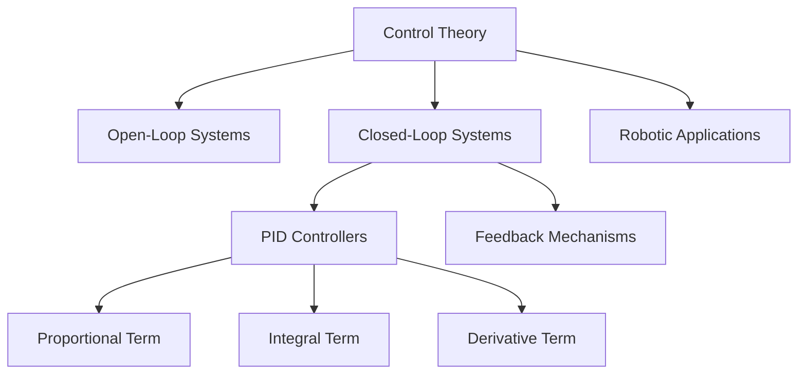
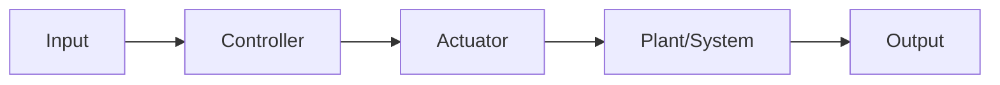
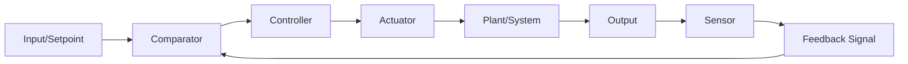
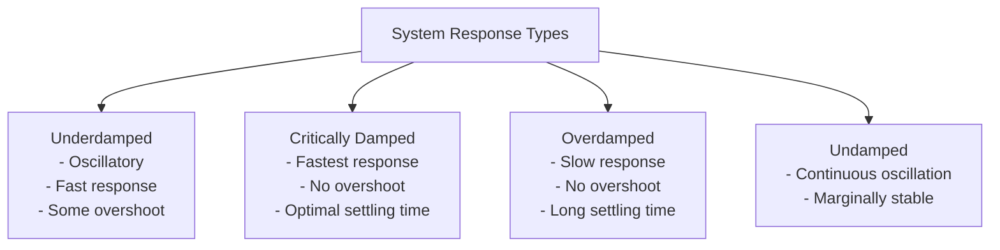
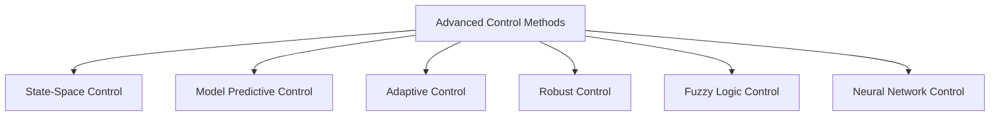
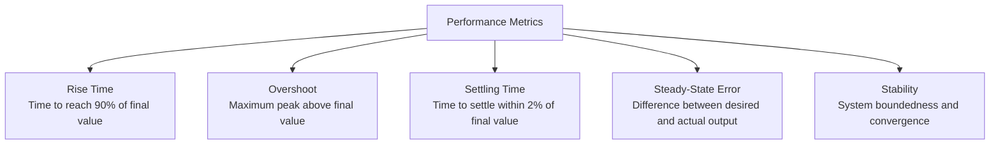

## Basic Control Theory: Guiding Robotic Behavior

Control theory is the foundation upon which autonomous robotic behavior is built. It provides the mathematical framework and engineering principles to design systems that regulate their own behavior, allowing robots to perform tasks accurately, safely, and reliably. For physical AI and humanoid robotics, understanding basic control theory is crucial for enabling stable movement, precise manipulation, and intelligent interaction with dynamic environments.



### Learning Outcomes

Upon completing this section, you will be able to:

*   Define key concepts in control theory: open-loop, closed-loop, feedback.
*   Explain the role of sensors, controllers, and actuators in a control system.
*   Understand the principles of PID (Proportional-Integral-Derivative) control.
*   Identify common challenges in robotic control, such as stability and response time.
*   Discuss the importance of control theory in achieving precise and robust robotic motion.
*   Analyze system response graphs and tune PID controllers for optimal performance.

### 1. Fundamental Concepts of Control Systems

A control system is a device or set of devices that manages, commands, directs, or regulates the behavior of other devices or systems. In robotics, control systems are responsible for translating high-level commands into precise physical actions.

#### 1.1 Open-Loop Control Systems

In an **open-loop control system**, the control action is independent of the output. The system executes a predefined sequence of actions without using feedback to determine if the desired outcome was achieved. They are simple and inexpensive but lack accuracy and robustness to disturbances.



*   **Characteristics:**
    *   No feedback path from output to input
    *   Control action is predetermined and fixed
    *   Simple design and implementation
    *   Economical solution for basic applications
    *   Susceptible to disturbances and modeling inaccuracies
    
*   **Example:** A toaster. You set a timer, and it toasts for that duration regardless of how dark the toast actually gets.

#### 1.2 Closed-Loop Control Systems (Feedback Control)

A **closed-loop control system**, also known as a **feedback control system**, uses the output of the system to influence the control action. It continuously measures the actual output, compares it to the desired input (setpoint), and calculates an error signal to adjust the system's behavior. This allows for greater accuracy, stability, and disturbance rejection.



*   **Components:**
    *   **Setpoint (Reference Input):** The desired value or state (e.g., target joint angle).
    *   **Controller:** Calculates the control action based on the error.
    *   **Actuator:** Executes the control action (e.g., servo motor).
    *   **Plant (Controlled System):** The physical system being controlled (e.g., robot arm joint).
    *   **Sensor:** Measures the actual output of the plant (e.g., encoder measuring joint angle).
    *   **Feedback Loop:** The path from the output measurement back to the controller.
    
*   **Advantages:**
    *   Improved accuracy and precision
    *   Better disturbance rejection
    *   Reduced sensitivity to parameter variations
    *   Enhanced stability characteristics
    
*   **Example:** A thermostat in a room. It measures the current temperature, compares it to the desired temperature, and turns the heater on or off to reduce the error.

### 2. The PID Controller: A Ubiquitous Solution

The **Proportional-Integral-Derivative (PID) controller** is the most common feedback control algorithm used in industrial control systems and robotics due to its simplicity, effectiveness, and wide applicability. It continuously calculates an "error" value as the difference between a desired setpoint and a measured process variable and applies a correction based on proportional, integral, and derivative terms.

```mermaid
graph LR
    A[Error e(t)] --> B[P Component]
    A --> C[I Component]
    A --> D[D Component]
    B --> E[Summing Junction]
    C --> E
    D --> E
    E --> F[Control Output u(t)]
```

*   **P (Proportional Term):**
    *   **Function:** Corrects the error proportionally to its current value. A larger error leads to a larger corrective action.
    *   **Effect:** Reduces the rise time but can lead to oscillations and a steady-state error (offset).
    *   **Graphical Representation:** In a step response, increasing Kp reduces steady-state error but increases overshoot.

*   **I (Integral Term):**
    *   **Function:** Corrects the error based on the accumulation (integral) of past errors. It works to eliminate steady-state error.
    *   **Effect:** Eliminates steady-state error but can increase overshoot and settling time, potentially leading to instability.
    *   **Graphical Representation:** In a step response, the integral term eliminates offset but may cause oscillatory behavior.

*   **D (Derivative Term):**
    *   **Function:** Corrects the error based on the rate of change (derivative) of the error. It anticipates future errors.
    *   **Effect:** Reduces overshoot, improves stability, and decreases settling time, but can amplify noise.
    *   **Graphical Representation:** In a step response, the derivative term reduces overshoot and improves damping.


Where:
*   e(t) is the error at time t (setpoint - actual value)
*   Kp is the proportional gain
*   Ki is the integral gain
*   Kd is the derivative gain

#### Response Characteristics Visualization:



#### Tuning PID Controllers:

Tuning involves adjusting the Kp, Ki, Kd gains to achieve the desired system response (e.g., fast response, minimal overshoot, no steady-state error). This is often an iterative process, potentially involving trial and error or more systematic methods like Ziegler-Nichols.

##### Common Tuning Effects:

| Parameter | Rise Time | Overshoot | Settling Time | Steady-State Error | Stability |
|----------|-----------|-----------|---------------|-------------------|----------|
| Kp | Decrease | Increase | Small change | Decrease | Degrade |
| Ki | Decrease | Increase | Increase | Eliminate | Degrade |
| Kd | Minor change | Decrease | Decrease | No change | Improve |

### 3. Challenges in Robotic Control

Robotic systems present unique control challenges due to their complex dynamics, non-linearities, and interaction with the physical world.

*   **Stability:** Ensuring the robot remains stable and does not oscillate uncontrollably or fall over (especially for humanoids).
*   **Response Time:** How quickly the robot can react to commands and environmental changes.
*   **Overshoot:** When the robot's movement exceeds the target before settling, which can be dangerous or inefficient.
*   **Steady-State Error:** A persistent difference between the desired and actual output after the system has settled.
*   **Disturbances:** External forces (e.g., pushes, uneven terrain) that try to move the robot away from its desired state.
*   **Non-linearities:** Factors like friction, backlash in gears, and varying loads that make simple linear control models insufficient.
*   **Actuator Limits:** Motors have maximum torque and speed, and joints have physical limits, which must be respected by the controller.

### 4. Advanced Control Techniques in Robotics

Beyond basic PID control, robotics often employs more sophisticated control strategies:



*   **State-Space Control:** Uses state variables to represent the system and applies modern control theory for multi-input, multi-output systems.
*   **Model Predictive Control (MPC):** Predicts future system behavior over a time horizon and optimizes control actions accordingly.
*   **Adaptive Control:** Adjusts controller parameters in real-time to accommodate changes in system dynamics.
*   **Robust Control:** Designs controllers that maintain performance despite uncertainties in the system model.
*   **Fuzzy Logic Control:** Uses linguistic variables and rules to handle imprecise or uncertain information.
*   **Neural Network Control:** Employs artificial neural networks to learn and adapt control policies from data.

### 5. Importance in Physical AI and Humanoid Robotics

Control theory is indispensable for physical AI and humanoid robots:

*   **Precise Motion:** Enabling robots to perform delicate tasks like grasping objects or walking on narrow surfaces.
*   **Balance & Stability:** Critical for bipedal locomotion, ensuring the humanoid does not fall.
*   **Interaction Control:** Allowing robots to safely and effectively interact with humans and objects by regulating applied forces.
*   **Trajectory Tracking:** Guiding robots to follow desired paths and movements accurately.
*   **Adaptation:** More advanced control strategies allow robots to adapt to changing payloads, environmental conditions, and unexpected events.

### Example: PID Control for a Humanoid Joint

Imagine a single joint in a humanoid robot's arm that needs to move to a specific angle. A PID controller would be used:

1.  **Setpoint:** The desired angle for the joint (e.g., 90 degrees).
2.  **Sensor:** An encoder measures the current joint angle.
3.  **Error Calculation:** The difference between the desired angle and the current angle (e(t) = 90 - current_angle).
4.  **PID Output:** The controller calculates a torque command based on Kp, Ki, and Kd gains and the error.
5.  **Actuator:** A servo motor receives the torque command and moves the joint.
6.  **Feedback:** The new joint angle is measured by the encoder, and the process repeats, constantly adjusting to reach and maintain the setpoint.

This continuous feedback loop allows the joint to reach its target smoothly, quickly, and without oscillation, even if external forces try to push it off course.

### Control System Performance Metrics

To evaluate control system performance, engineers use several key metrics:



These metrics help in tuning controllers and comparing different control strategies.

---

### Review Questions

1.  How does a closed-loop control system fundamentally differ from an open-loop system, and what is the primary advantage of a closed-loop system?
2.  List and briefly describe the three main components (terms) of a PID controller.
3.  What effect does increasing the proportional gain (Kp) typically have on a control system's response?
4.  Explain why the integral term (Ki) is often necessary in a PID controller for robotic applications.
5.  Identify two significant challenges encountered when controlling complex robotic systems and how feedback control helps address them.
6.  Sketch and label a block diagram of a closed-loop control system.
7.  Describe how each component of a PID controller affects the system's step response.
8.  What are the trade-offs between using a high versus low derivative gain (Kd)?