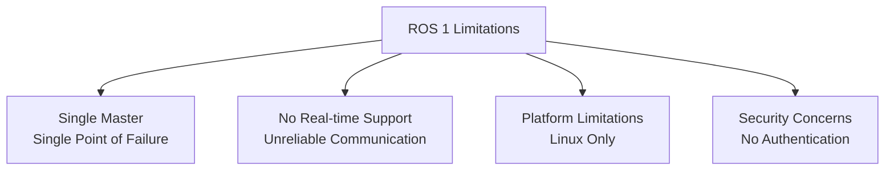
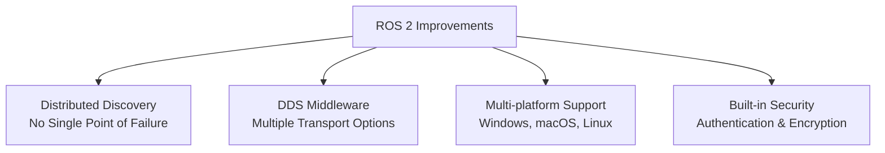
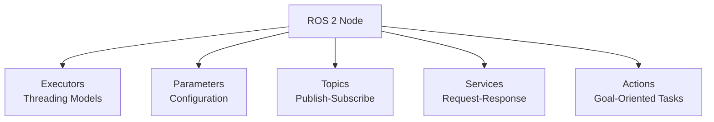
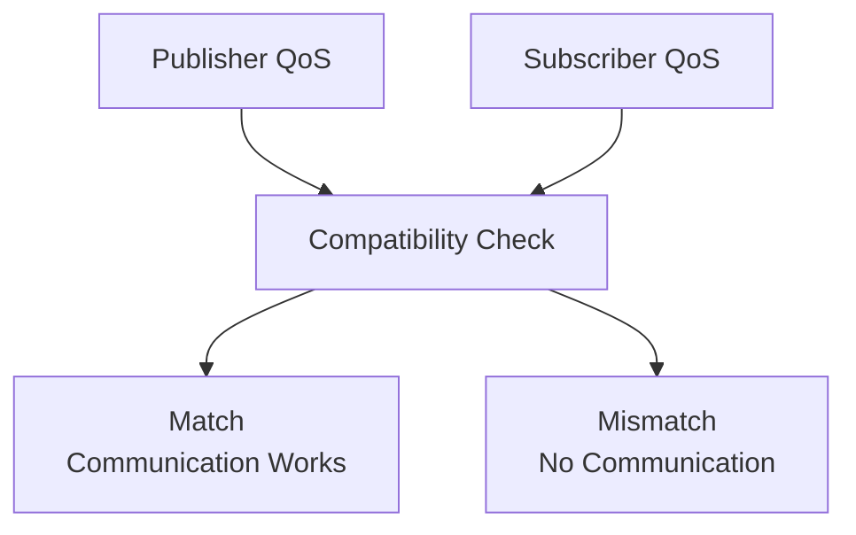

## ROS 2 Architecture: The Foundation of Modern Robotics

Robot Operating System 2 (ROS 2) represents a significant evolution from its predecessor, designed specifically to address the limitations of ROS 1 for modern robotics applications. This section explores the architectural improvements, core concepts, and distributed computing capabilities that make ROS 2 the de facto standard for robotics development.

### Learning Outcomes

Upon completing this section, you will be able to:

*   Understand the key architectural improvements in ROS 2 over ROS 1.
*   Explain the role of DDS (Data Distribution Service) in ROS 2 communication.
*   Identify the core components of the ROS 2 architecture.
*   Differentiate between nodes, topics, services, and actions.
*   Appreciate how Quality of Service (QoS) policies enhance communication reliability.

### 1. Evolution from ROS 1 to ROS 2

ROS 2 was developed to address several critical limitations in ROS 1:

#### 1.1. Limitations of ROS 1

*   **Single Master Architecture:** ROS 1 relied on a single master node (roscore) that acted as a centralized hub for discovery and registration. This created a single point of failure.
*   **TCPROS Communication:** All communication was based on TCP, which lacked real-time guarantees and was not suitable for time-critical applications.
*   **Limited Platform Support:** Primarily designed for Ubuntu Linux, with limited support for other operating systems.
*   **No Built-in Security:** Lacked authentication, encryption, and access control mechanisms.

#### 1.2. ROS 2 Solutions

*   **Distributed Discovery:** Uses DDS (Data Distribution Service) for decentralized discovery, eliminating the single master bottleneck.
*   **Multiple Communication Options:** Supports various transport protocols through DDS implementations, including UDP, TCP, and shared memory.
*   **Real-time Capabilities:** Designed with real-time constraints in mind, supporting deterministic communication patterns.
*   **Cross-platform Compatibility:** Official support for Windows, macOS, and multiple Linux distributions.
*   **Native Security:** Built-in security features including authentication, encryption, and access control.

### 2. Core Architecture Components

#### 2.1. DDS (Data Distribution Service)

DDS serves as the communication middleware in ROS 2:

*   **Publish-Subscribe Model:** Nodes communicate through topics using a publish-subscribe pattern.
*   **Decentralized Discovery:** Nodes discover each other automatically without a central master.
*   **Quality of Service (QoS):** Configurable policies for reliability, durability, and other communication characteristics.
*   **Multiple Implementations:** Supports various DDS vendors (FastDDS, Cyclone DDS, etc.) for flexibility.

#### 2.2. Node Concept

Nodes are the fundamental building blocks of ROS 2 systems:

*   **Execution Models:** Nodes can be single-threaded or multi-threaded using executors.
*   **Parameter Server:** Each node can have its own parameter server for configuration.
*   **Communication Primitives:** Nodes communicate using topics, services, and actions.

### 3. Communication Patterns

ROS 2 provides several communication patterns for different use cases:

#### 3.1. Topics (Publish-Subscribe)

Ideal for continuous data streams:

*   **Asynchronous Communication:** Publishers send data without knowing who receives it.
*   **Multiple Subscribers:** Multiple nodes can subscribe to the same topic.
*   **Decoupled Design:** Publishers and subscribers don't need to know about each other.

#### 3.2. Services (Request-Response)

Suitable for remote procedure calls:

*   **Synchronous Communication:** Client waits for server response.
*   **One-to-One Mapping:** Each service call connects one client to one server.
*   **Bidirectional Data Flow:** Request from client, response from server.

#### 3.3. Actions

Designed for long-running tasks with feedback:

*   **Goal-Oriented:** Client specifies a goal for the server to achieve.
*   **Feedback Channel:** Server provides progress updates during execution.
*   **Result Reporting:** Final result delivered upon completion.

### 4. Quality of Service (QoS) Policies

QoS policies allow fine-grained control over communication characteristics:

#### 4.1. Key QoS Policies

*   **Reliability:** Controls message delivery guarantees (reliable vs. best-effort).
*   **Durability:** Determines if late-joining subscribers receive historical data.
*   **History:** Specifies how many messages to keep in the publisher queue.
*   **Deadline:** Ensures messages are published within specified time intervals.
*   **Liveliness:** Monitors if publishers are still alive and active.

#### 4.2. QoS Compatibility

For communication to work, publishers and subscribers must have compatible QoS settings:

### 5. Execution Models

ROS 2 supports various execution models for different application requirements:

#### 5.1. Single-Threaded Executor

Simple model where all callbacks execute in a single thread:

*   **Deterministic Behavior:** No race conditions or threading issues.
*   **Limited Concurrency:** Cannot process multiple callbacks simultaneously.
*   **Easy Debugging:** Simplified debugging and profiling.

#### 5.2. Multi-Threaded Executor

Allows concurrent execution of callbacks:

*   **Improved Performance:** Better utilization of multi-core processors.
*   **Increased Complexity:** Requires careful handling of shared resources.
*   **Scalability:** Better performance with many nodes or high-frequency callbacks.

### 6. Security Features

ROS 2 includes built-in security capabilities:

#### 6.1. Security Components

*   **Authentication:** Verifies the identity of participants in the system.
*   **Encryption:** Protects message contents from eavesdropping.
*   **Access Control:** Restricts which nodes can communicate with each other.

#### 6.2. Security Implementation

*   **Security Keys:** Cryptographic keys for authentication and encryption.
*   **Permissions Files:** Define access control policies for nodes.
*   **Governance Files:** Specify security settings for the entire system.

### 7. Real-time Considerations

ROS 2 addresses real-time requirements through several mechanisms:

#### 7.1. Real-time Capable Components

*   **Real-time Executors:** Specialized executors designed for deterministic execution.
*   **Memory Management:** Pre-allocated memory pools to avoid dynamic allocation.
*   **Lock-Free Data Structures:** Minimize contention and blocking in critical paths.

#### 7.2. Platform Support

*   **Real-time Linux:** Support for PREEMPT_RT kernel patches.
*   **RTOS Integration:** Compatibility with real-time operating systems.
*   **Hardware Acceleration:** Support for specialized networking hardware.

### 8. Ecosystem and Tooling

ROS 2 maintains and extends the rich ecosystem of ROS 1:

#### 8.1. Development Tools

*   **Visualization:** rviz2 for 3D visualization of robot data.
*   **Debugging:** rqt for GUI-based debugging and monitoring.
*   **Simulation:** Integration with Gazebo and other simulation tools.

#### 8.2. Package Management

*   **Colcon:** Build system for compiling ROS 2 packages.
*   **Package Repositories:** Extensive collection of community-contributed packages.
*   **Dependency Management:** Automatic resolution of package dependencies.

The ROS 2 architecture represents a mature, production-ready framework for building complex robotic systems. Its distributed design, real-time capabilities, and security features make it suitable for a wide range of applications, from research prototypes to commercial products.

---

### Review Questions

1.  What is the primary communication middleware used in ROS 2, and what are two advantages it offers over ROS 1's communication?
2.  Define a "node" in ROS 2 and explain its role in a robotic system.
3.  Differentiate between ROS 2 Topics and Services in terms of their communication patterns and typical use cases.
4.  When would you use a ROS 2 Action instead of a Service?
5.  How do QoS policies contribute to the robustness and flexibility of ROS 2 communication?