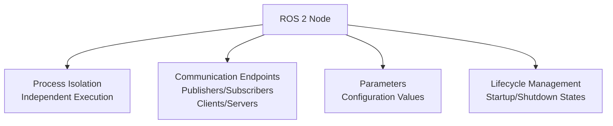
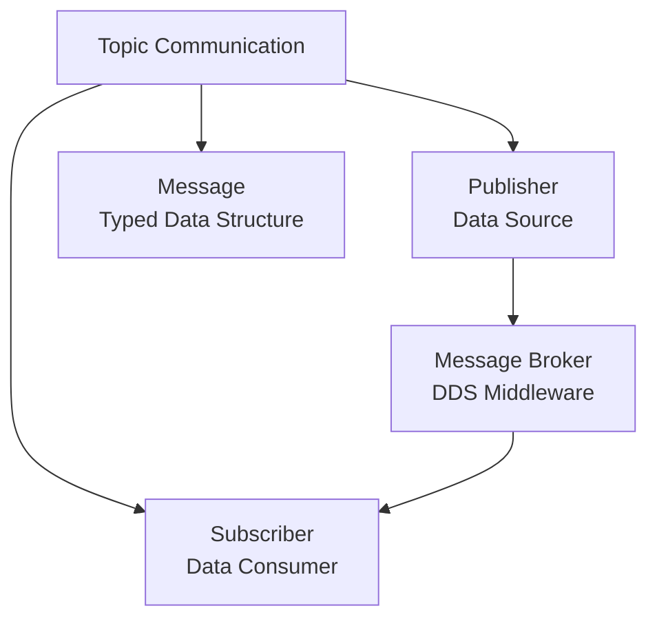
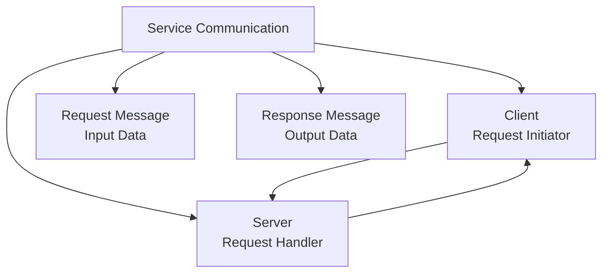
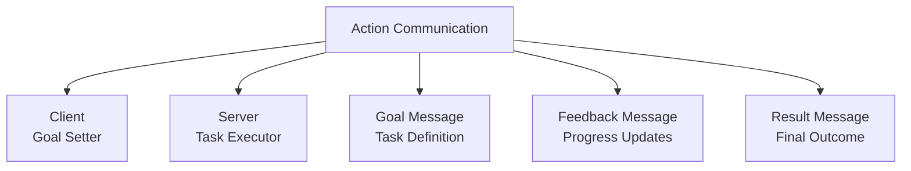
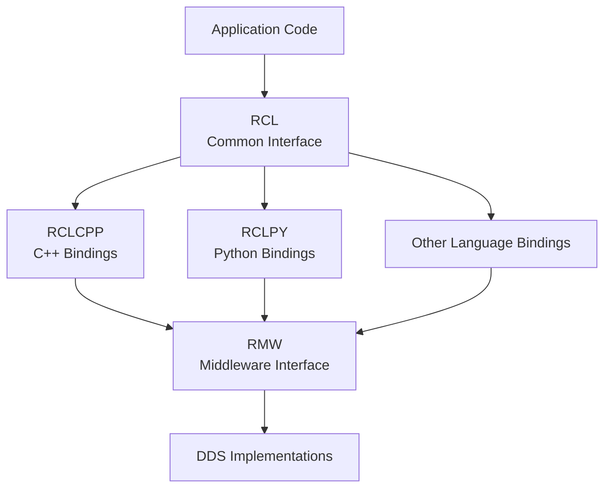

## Nodes, Topics, and Services: Core Communication Primitives in ROS 2

Understanding the fundamental communication primitives in ROS 2 is essential for building effective robotic applications. This section delves into nodes, topics, and services—the core building blocks that enable distributed computation and coordinated behavior in robotic systems.

### Learning Outcomes

Upon completing this section, you will be able to:

*   Create and configure ROS 2 nodes with appropriate lifecycles.
*   Implement publish-subscribe communication using topics.
*   Design request-response interactions using services.
*   Select the appropriate communication pattern for different scenarios.
*   Understand the role of client libraries in ROS 2 development.

### 1. Nodes: The Building Blocks of ROS 2

Nodes are the fundamental executable units in ROS 2, representing processes that perform computation. Each node typically handles a specific function within a robotic system.

#### 1.1. Node Characteristics

*   **Process Isolation:** Each node runs as a separate process, providing fault isolation.
*   **Communication Endpoints:** Nodes contain publishers, subscribers, clients, and servers.
*   **Parameter Management:** Nodes can store and retrieve configuration parameters.
*   **Lifecycle Control:** Nodes can have managed lifecycles with distinct states.

#### 1.2. Node Creation and Management

*   **Programming Languages:** Nodes can be written in C++, Python, or other supported languages.
*   **Node Handles:** Interface for interacting with the ROS 2 system.
*   **Namespaces:** Logical grouping of nodes for organization.
*   **Remapping:** Ability to redirect topics, services, and parameters at runtime.

### 2. Topics: Publish-Subscribe Communication

Topics implement the publish-subscribe pattern, enabling asynchronous, many-to-many communication between nodes.

#### 2.1. Topic Fundamentals

*   **Publishers:** Nodes that send data to a topic.
*   **Subscribers:** Nodes that receive data from a topic.
*   **Messages:** Typed data structures that define the content of communication.
*   **Decoupling:** Publishers and subscribers don't need to know about each other.

#### 2.2. Message Types and Interfaces

*   **Standard Messages:** Predefined message types for common data (geometry, sensor data, etc.).
*   **Custom Messages:** User-defined message types for application-specific data.
*   **Interface Definition Language (IDL):** Defines message structure and serialization.

#### 2.3. Quality of Service (QoS) for Topics

*   **Reliability Policy:** Reliable (guaranteed delivery) vs. Best Effort (no guarantees).
*   **Durability Policy:** Transient Local (historical data) vs. Volatile (no history).
*   **History Policy:** Keep Last N messages or Keep All messages.

### 3. Services: Request-Response Communication

Services implement synchronous request-response communication for remote procedure calls.

#### 3.1. Service Fundamentals

*   **Clients:** Nodes that initiate service calls.
*   **Servers:** Nodes that respond to service requests.
*   **Synchronous Operation:** Clients block until servers respond.
*   **Bidirectional Data Flow:** Requests contain input data, responses contain output data.

#### 3.2. Service Design Considerations

*   **Atomic Operations:** Services should perform indivisible operations.
*   **Timeout Handling:** Clients should handle server unresponsiveness.
*   **Blocking Nature:** Long-running operations should use Actions instead.

### 4. Actions: Goal-Oriented Communication

Actions are designed for long-running tasks that require feedback and preemptability.

#### 4.1. Action Components

*   **Goals:** Tasks that clients request servers to accomplish.
*   **Feedback:** Periodic updates on task progress.
*   **Results:** Final outcomes when tasks complete.
*   **Preemption:** Ability to cancel ongoing tasks.

### 5. Choosing Communication Patterns

Selecting the appropriate communication pattern is crucial for effective system design:

#### 5.1. When to Use Topics

*   **Continuous Data Streams:** Sensor data, telemetry, state updates.
*   **Multiple Receivers:** Broadcasting information to multiple consumers.
*   **Asynchronous Processing:** Non-blocking communication patterns.
*   **Decoupled Components:** Independent modules that don't need coordination.

#### 5.2. When to Use Services

*   **Remote Procedure Calls:** Triggering specific computations or actions.
*   **Configuration Changes:** Modifying node behavior dynamically.
*   **Query Operations:** Retrieving specific information on demand.
*   **Infrequent Operations:** Tasks that don't occur continuously.

#### 5.3. When to Use Actions

*   **Long-Running Tasks:** Operations that take significant time to complete.
*   **Progress Monitoring:** Tasks where intermediate feedback is valuable.
*   **Preemptability:** Operations that might need to be canceled.
*   **Complex Workflows:** Multi-step processes with distinct phases.

### 6. Client Libraries (RCL)

ROS Client Libraries provide language-specific interfaces to the ROS 2 core.

#### 6.1. RCL Layers

*   **RCL (ROS Client Library):** Common interface layer for all language bindings.
*   **RCLCPP:** C++ implementation of the client library.
*   **RCLPY:** Python implementation of the client library.
*   **Language Interoperability:** Consistent APIs across programming languages.

#### 6.2. RMW (ROS Middleware Interface)

*   **Abstraction Layer:** Decouples client libraries from specific DDS implementations.
*   **Vendor Neutrality:** Allows switching between DDS vendors without code changes.
*   **Performance Optimization:** Enables middleware-specific optimizations.

### 7. Best Practices

#### 7.1. Node Design

*   **Single Responsibility:** Each node should have a focused, well-defined purpose.
*   **Appropriate Granularity:** Balance between too many small nodes and too few large nodes.
*   **Resource Management:** Properly manage memory, CPU, and network resources.

#### 7.2. Communication Design

*   **Message Design:** Create efficient, well-structured message types.
*   **QoS Configuration:** Match QoS settings to application requirements.
*   **Error Handling:** Implement robust error handling and recovery mechanisms.

#### 7.3. System Architecture

*   **Modular Design:** Build systems from composable, reusable components.
*   **Scalability:** Design for growth in nodes, data volume, and complexity.
*   **Maintainability:** Structure systems for easy debugging and modification.

Understanding these core communication primitives enables developers to build robust, scalable, and maintainable robotic applications using ROS 2.

---

### Review Questions

1.  What is the main purpose of a ROS 2 node, and how does it contribute to the modularity of a robotic application?
2.  Describe the publisher-subscriber pattern used by ROS 2 topics. Provide an example of data that would typically be communicated via a topic.
3.  Explain the client-server pattern used by ROS 2 services. Provide an example of an interaction that would typically be handled by a service.
4.  When designing a robotic system, how would you decide whether to use a ROS 2 topic or a ROS 2 service for a particular communication need?
5.  What are ROS Client Libraries (RCL), and why are they important in ROS 2 development?