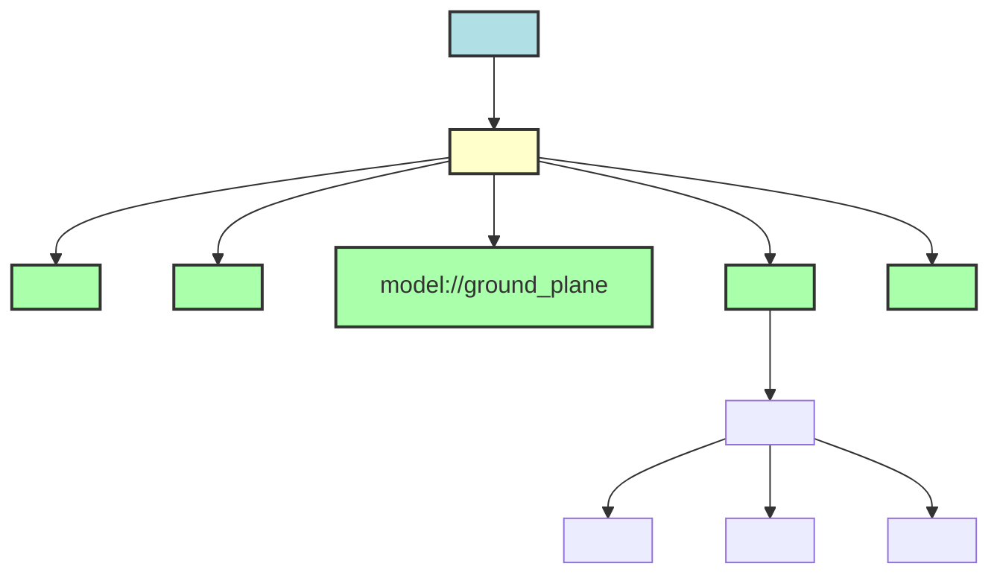

import Mermaid from '@theme/Mermaid';

## Learning Outcomes

After completing this section, you will be able to:
- Understand the comprehensive structure and syntax of a Gazebo world definition file (SDF).
- Create a custom Gazebo world file from scratch, defining its terrain, lighting, and global physics properties.
- Integrate static and dynamic models into your custom worlds, including objects from the Gazebo Model Database and custom-defined entities.
- Configure environmental parameters such as gravity, time step, and various light sources to create realistic scenarios.
- Leverage the Gazebo Model Database and Gazebo Fuel to efficiently populate your simulation environments.
- Appreciate the critical role of custom worlds in testing humanoid robots in diverse, complex, and realistic settings.

## 1. The Gazebo World File (SDF)

A **Gazebo world file** is an SDF (Simulation Description Format) XML file that meticulously describes the entire simulation environment. It's the blueprint for your virtual testing ground, specifying everything from the global physics settings and environmental conditions to the placement and properties of all static and dynamic models within the scene. Unlike URDF, which is primarily for single robot descriptions, SDF is Gazebo's native and more expressive format for defining entire worlds and multiple models.

The world file serves as the canvas upon which your robot operates. For humanoid robots, the ability to create varied and complex worlds (e.g., simulated houses, offices, outdoor terrains, disaster zones) is crucial for:
-   **Realistic Navigation:** Testing obstacle avoidance, path planning, and terrain negotiation.
-   **Interaction Scenarios:** Populating environments with objects for manipulation, human-robot interaction studies, and task execution.
-   **Sensor Validation:** Providing diverse scenes for camera, LiDAR, and IMU simulations.
-   **Benchmarking:** Creating standardized environments for comparing different robot control or perception algorithms.

### Basic Structure of an SDF World File

A typical Gazebo world file follows a hierarchical structure:

```xml
<?xml version="1.0" ?>
<sdf version="1.8"> <!-- SDF version, important for compatibility -->
  <world name="my_custom_world">
    <!-- Physics engine configuration -->
    <physics type="ode">
      <!-- ... physics parameters ... -->
    </physics>

    <!-- Global lighting configuration -->
    <light name="sun" type="directional">
      <!-- ... light parameters ... -->
    </light>

    <!-- Ground plane (optional) -->
    <include>
      <uri>model://ground_plane</uri>
    </include>

    <!-- Models within the world -->
    <model name="my_wall">
      <!-- ... wall definition (links, visuals, collisions) ... -->
    </model>

    <include>
      <uri>model://table</uri> <!-- Include model from Gazebo Fuel -->
    </include>

    <!-- World plugins (optional) -->
    <plugin name="my_world_plugin" filename="libMyWorldPlugin.so"/>
  </world>
</sdf>
```
-   `<sdf version="1.8">`: The root tag, specifying the SDF version. Version `1.8` is common for Gazebo Garden.
-   `<world name="my_custom_world">`: The main container for the world definition.
-   `<physics>`: Configures the physics engine (e.g., ODE, DART, Bullet) and its properties (gravity, time step).
-   `<light>`: Defines light sources in the world.
-   `<include>`: Used to import external models (e.g., from Gazebo Model Database or local directories).
-   `<model>`: Allows direct definition of models (links, joints, visuals, collisions, inertials) within the world file itself, typically for static environmental objects.
-   `<plugin>`: Loads world-level plugins (discussed in Section 8.4).

:::tip Diagram Suggestion: SDF World File Structure
A conceptual diagram illustrating the hierarchy of tags within an SDF world file, from root to nested elements.



*This diagram visually represents the typical XML-like structure of a Gazebo SDF world file, showing its main components.*
:::

## 2. Creating a Custom World

You can create a custom world by defining an SDF file tailored to your simulation needs. This allows you to control every aspect of the environment.

### Step-by-Step: Creating a Simple Office World

Let's create a basic office-like world with a grey floor, some ambient lighting, and a few simple walls.

1.  **Create a New File:**
    Inside your ROS 2 simulation package (e.g., `my_robot_gazebo_sim`), create a `worlds` directory if it doesn't exist. Then, create a file named `my_office_world.sdf` within it.

2.  **Define the Basic World Structure:**
    Start with the root SDF and world tags, and define a simple gravity.

    ```xml
    <?xml version="1.0" ?>
    <sdf version="1.8">
      <world name="my_office_world">
        <!-- Global gravity (default is -9.8 m/s^2 in Z direction) -->
        <gravity>0 0 -9.8</gravity>

        <!-- Global physics engine settings -->
        <physics name="1ms" type="ode">
          <max_step_size>0.001</max_step_size>
          <real_time_factor>1.0</real_time_factor>
        </physics>
        
        <!-- Sun light source -->
        <light name="sun" type="directional">
          <cast_shadows>true</cast_shadows>
          <pose>0 0 10 0 0 0</pose>
          <diffuse>0.8 0.8 0.8 1</diffuse>
          <specular>0.2 0.2 0.2 1</specular>
          <attenuation>
            <range>1000</range>
            <constant>0.9</constant>
            <linear>0.01</linear>
            <quadratic>0.001</quadratic>
          </attenuation>
          <direction>-0.5 0.1 -0.9</direction>
        </light>

        <!-- Ground plane -->
        <include>
          <uri>model://ground_plane</uri>
        </include>

        <!-- Add custom models (e.g., walls) here -->
        <!-- ... -->

      </world>
    </sdf>
    ```

3.  **Add Static Walls (Custom Models):**
    Define simple box models directly within the `<world>` tag to act as walls. We'll give them visual and collision properties.

    ```xml
    <?xml version="1.0" ?>
    <sdf version="1.8">
      <world name="my_office_world">
        <gravity>0 0 -9.8</gravity>
        <physics name="1ms" type="ode">
          <max_step_size>0.001</max_step_size>
          <real_time_factor>1.0</real_time_factor>
        </physics>
        <light name="sun" type="directional">
          <cast_shadows>true</cast_shadows>
          <pose>0 0 10 0 0 0</pose>
          <diffuse>0.8 0.8 0.8 1</diffuse>
          <specular>0.2 0.2 0.2 1</specular>
          <attenuation><range>1000</range><constant>0.9</constant><linear>0.01</linear><quadratic>0.001</quadratic></attenuation>
          <direction>-0.5 0.1 -0.9</direction>
        </light>
        <include>
          <uri>model://ground_plane</uri>
        </include>

        <!-- --- Custom Walls --- -->
        <model name="wall_long_1">
          <static>true</static> <!-- This model will not be affected by physics -->
          <link name="link">
            <pose>2 0 1 0 0 0</pose> <!-- Position and orientation of the wall -->
            <visual name="visual">
              <geometry><box><size>4 0.1 2</size></box></geometry>
              <material><ambient>0.6 0.6 0.6 1</ambient><diffuse>0.6 0.6 0.6 1</diffuse></material>
            </visual>
            <collision name="collision">
              <geometry><box><size>4 0.1 2</size></box></geometry>
            </collision>
          </link>
        </model>

        <model name="wall_long_2">
          <static>true</static>
          <link name="link">
            <pose>-2 0 1 0 0 0</pose>
            <visual name="visual">
              <geometry><box><size>4 0.1 2</size></box></geometry>
              <material><ambient>0.6 0.6 0.6 1</ambient><diffuse>0.6 0.6 0.6 1</diffuse></material>
            </visual>
            <collision name="collision">
              <geometry><box><size>4 0.1 2</size></box></geometry>
            </collision>
          </link>
        </model>

        <model name="wall_short_1">
          <static>true</static>
          <link name="link">
            <pose>0 2 1 0 0 1.5707</pose> <!-- Rotated 90 degrees (pi/2) for y-axis wall -->
            <visual name="visual">
              <geometry><box><size>4 0.1 2</size></box></geometry>
              <material><ambient>0.6 0.6 0.6 1</ambient><diffuse>0.6 0.6 0.6 1</diffuse></material>
            </visual>
            <collision name="collision">
              <geometry><box><size>4 0.1 2</size></box></geometry>
            </collision>
          </link>
        </model>

        <model name="wall_short_2">
          <static>true</static>
          <link name="link">
            <pose>0 -2 1 0 0 1.5707</pose>
            <visual name="visual">
              <geometry><box><size>4 0.1 2</size></box></geometry>
              <material><ambient>0.6 0.6 0.6 1</ambient><diffuse>0.6 0.6 0.6 1</diffuse></material>
            </visual>
            <collision name="collision">
              <geometry><box><size>4 0.1 2</size></box></geometry>
            </collision>
          </link>
        </model>
        <!-- --- End Custom Walls --- -->

      </world>
    </sdf>
    ```
This SDF defines a 4x4 meter room with 2-meter high walls.

### Launching a Custom World

You can launch this world from the command line:
```bash
gazebo my_office_world.sdf
```
Or, more commonly, from a ROS 2 launch file, by passing the world file path as an argument to `gz_sim.launch.py` (as shown in Section 8.5, Example 5.2):
```python
    gazebo_launch = IncludeLaunchDescription(
        PythonLaunchDescriptionSource(
            os.path.join(get_package_share_directory('ros_gz_sim'), 'launch', 'gz_sim.launch.py')
        ),
        launch_arguments={'gz_args': world_path}.items() # world_path points to my_office_world.sdf
    )
```

## 3. Adding Models to a World

Populating your custom world with various objects is essential for creating realistic and challenging simulation scenarios.

### 3.1 Including Models from Gazebo Fuel (Model Database)

Gazebo Fuel is an online repository (https://fuel.gazebosim.org/) where you can find a vast collection of pre-built 3D models. These models can be directly included in your world file using the `<include>` tag and a `uri` (Uniform Resource Identifier).

**Example: Adding a Table and a Chair:**
```xml
        <!-- ... existing world content ... -->

        <include>
          <uri>https://fuel.gazebosim.org/1.0/Gazebo/models/Table</uri>
          <name>office_table_1</name>
          <pose>0 0 0.73 0 0 0</pose> <!-- Position table in the center -->
        </include>

        <include>
          <uri>https://fuel.gazebosim.org/1.0/Gazebo/models/Chair</uri>
          <name>office_chair_1</name>
          <pose>0.5 0 0.45 0 0 -1.5707</pose> <!-- Position chair, rotated -->
        </include>
```
You can also use shorthand URIs like `model://table` if the model is located in a standard Gazebo model path or specified in your `GAZEBO_MODEL_PATH` environment variable.

### 3.2 Defining Custom Models Directly in the World File

As seen with the walls in Section 2, you can define simpler static objects directly within the `<model>` tag inside your `<world>` file. This is useful for basic shapes or objects that don't need to be reusable as standalone models.

**Key elements within a `<model>` tag:**
-   `<static>true/false</static>`: If true, the model will not be affected by physics (e.g., immovable walls, ground).
-   `<link name="link_name">`: Defines a rigid body part of the model.
    *   `<pose>x y z roll pitch yaw</pose>`: Position and orientation of the link relative to the model's origin.
    *   `<visual name="visual_name">`: Defines the appearance of the link.
        *   `<geometry>`: Shape (box, cylinder, sphere, mesh).
        *   `<material>`: Color (ambient, diffuse, specular) and texture.
    *   `<collision name="collision_name">`: Defines the physical shape for collision detection.
        *   `<geometry>`: Shape (usually simpler than visual for performance).
    *   `<inertial>`: Defines mass properties (mass, inertia matrix, center of mass - essential for dynamic models).

### 3.3 Dynamic Models and Physics Interaction

Models included or defined in the world can be either `static` (immovable, like walls) or `dynamic` (affected by physics, like a robot or a ball). For dynamic models, accurate `<inertial>` (mass properties) and `<collision>` (physical boundaries) definitions are crucial for realistic physics simulation (as covered in Module 4.4).

## 4. Setting Physics and Lighting: Bringing Worlds to Life

The `<physics>` and `<light>` tags within the world file are critical for defining the environmental conditions and physical realism of your simulation.

### 4.1 Physics Configuration (`<physics>`)

The `<physics>` tag defines the global physics engine parameters.
-   `type`: Specifies the physics engine to use (e.g., `ode`, `bullet`, `dart`). ODE (Open Dynamics Engine) is a common default.
-   `<max_step_size>`: The maximum time step size the physics engine will use. Smaller values increase accuracy but decrease simulation speed.
-   `<real_time_update_rate>`: The target update rate for the simulation (Hz).
-   `<real_time_factor>`: The ratio of simulated time to real time. A value of 1.0 means the simulation attempts to run in real time.
-   `<gravity>x y z</gravity>`: The global gravity vector. Default is `0 0 -9.8` m/s².

**Example Physics settings:**
```xml
        <physics name="1ms" type="ode">
          <max_step_size>0.001</max_step_size>
          <real_time_update_rate>1000.0</real_time_update_rate> <!-- Target 1000 Hz physics update -->
          <real_time_factor>1.0</real_time_factor> <!-- Attempt to run in real-time -->
          <ode>
            <solver>
              <type>quick</type>
              <iters>50</iters>
              <sor>1.3</sor>
              <friction_model>cone</friction_model>
            </solver>
            <constraints>
              <cfm>0.0</cfm>
              <erp>0.2</erp>
            </constraints>
          </ode>
        </physics>
```

### 4.2 Lighting Configuration (`<light>`)

The `<light>` tag allows you to add various types of light sources to illuminate your world.
-   `type`: `directional` (like the sun), `point` (like a light bulb), or `spot` (like a spotlight).
-   `<pose>`: Position and orientation of the light.
-   `<diffuse>`, `<specular>`: Color components for diffuse (general surface color) and specular (highlights) reflections.
-   `<attenuation>`: How light intensity decreases with distance.
-   `<direction>`: For directional lights, the direction of light rays.
-   `<cast_shadows>true/false</cast_shadows>`: Whether the light source casts shadows.

**Example: Ambient and Spot Light**
```xml
        <!-- Global ambient light (diffuse, non-directional illumination) -->
        <light name="ambient_light" type="point">
            <pose>0 0 5 0 0 0</pose>
            <diffuse>0.5 0.5 0.5 1</diffuse>
            <specular>0.1 0.1 0.1 1</specular>
            <attenuation><range>20</range><constant>0.1</constant><linear>0.05</linear><quadratic>0.01</quadratic></attenuation>
            <cast_shadows>false</cast_shadows>
        </light>

        <!-- Task-specific spotlight -->
        <light name="task_spotlight" type="spot">
            <pose>0.5 0.5 2 0 -1.5707 0</pose> <!-- Pointing downwards -->
            <diffuse>0.7 0.7 0.7 1</diffuse>
            <specular>0.3 0.3 0.3 1</specular>
            <attenuation><range>10</range><constant>0.5</constant><linear>0.1</linear><quadratic>0.05</quadratic></attenuation>
            <direction>0 0 -1</direction>
            <spot><inner_angle>0.5</inner_angle><outer_angle>0.8</outer_angle><falloff>1.0</falloff></spot>
            <cast_shadows>true</cast_shadows>
        </light>
```

## 5. The Gazebo Model Database (Gazebo Fuel)

The **Gazebo Model Database**, also known as **Gazebo Fuel** (https://fuel.gazebosim.org/), is a powerful online resource providing a centralized repository of 3D models for use in Gazebo simulations. It hosts a wide variety of models, from simple furniture and everyday objects to complex robot components and entire environments.

### Benefits:
-   **Rich Content:** Access a vast library of ready-to-use models, saving significant development time.
-   **Standardization:** Many models are well-defined, with proper visual, collision, and inertial properties.
-   **Easy Integration:** Models can be easily included in your SDF world files using their URI.
-   **Community Contributions:** Users can upload and share their own models, fostering collaboration.

### Using Models from Fuel in Your World File

As shown previously, you use the `<include>` tag with the model's URI:
```xml
        <include>
          <uri>https://fuel.gazebosim.org/1.0/Gazebo/models/Coffee%20Cup</uri>
          <name>my_coffee_cup</name>
          <pose>0.2 0.3 0.75 0 0 0</pose>
        </include>
```
Or, if you have `GAZEBO_MODEL_PATH` set up correctly or are using standard models, a simpler `model://` URI might suffice:
```xml
        <include>
          <uri>model://construction_cone</uri>
          <name>cone_obstacle</name>
          <pose>1.0 1.0 0 0 0 0</pose>
        </include>
```

You can download models from Fuel and place them in your local `GAZEBO_MODEL_PATH` to ensure they are available offline or for customization.

:::tip Diagram Suggestion: Custom World Example
A simple bird's-eye view diagram of a custom world with a robot, walls, a table, and a light source.

```mermaid
graph TD
    A[Ground Plane]
    B[Wall 1]
    C[Wall 2]
    D[Table (from Fuel)]
    E[Robot (spawned)]
    F[Sun Light]

    A --- B
    A --- C
    A --- D
    A --- E
    F --- A

    style A fill:#aaffaa,stroke:#333,stroke-width:2px
    style B fill:#b0e0e6,stroke:#333,stroke-width:2px
    style C fill:#b0e0e6,stroke:#333,stroke-width:2px
    style D fill:#ffffcc,stroke:#333,stroke-width:2px
    style E fill:#f9c,stroke:#333,stroke-width:2px
    style F fill:#9cf,stroke:#333,stroke-width:2px
```

*This diagram illustrates a conceptual layout of a custom simulation world, including essential elements like ground, walls, and included models.*
:::

## 6. Exercises

1.  **Create an Indoor Office World:**
    *   Start with the `my_office_world.sdf` example from Section 2.
    *   Add at least two different models from the Gazebo Fuel online database (e.g., a "table," "chair," "bookshelf") into this world. Position them realistically within the room.
    *   Add an additional `point` light source within the room to simulate an overhead lamp, and adjust its properties (diffuse color, attenuation).
    *   Launch this custom world using `gazebo my_office_world.sdf` and inspect it in the GUI.
2.  **Outdoor Obstacle Course:**
    *   Create a new SDF world file called `my_obstacle_course.sdf`.
    *   Define a basic grassy ground plane (you can use `model://sun` and `model://ground_plane`).
    *   Add several static obstacles of different shapes (boxes, cylinders) defined directly within the world file. Position them to create a simple path for a robot to navigate.
    *   Include a `model://construction_cone` from Gazebo Fuel as a dynamic obstacle.
    *   Adjust the global `<physics>` parameters to a higher `real_time_factor` (e.g., 2.0) to see if you can speed up the simulation.
3.  **Model Manipulation via GUI:** Launch your `my_office_world.sdf`. Use the Gazebo GUI to move the spawned table model. Change its orientation and then lock it as `static` from the Inspector panel. Observe if it is still affected by gravity.
4.  **Launch World with Robot:** Take your `robot_sim.launch.py` from Section 8.5. Modify it to launch your `my_office_world.sdf` (from Exercise 1) instead of `empty.sdf`. Ensure your robot spawns at a suitable location within the office.
5.  **Environment Interaction (Conceptual):** Describe a scenario where a humanoid robot needs to pick up a specific object from your `my_office_world.sdf`. What aspects of the world definition (e.g., object pose, physics, lighting) are most critical for accurate simulation of this task?

## 7. Review Questions

1.  What is an **SDF file**, and what is its primary role in Gazebo simulations? How does it differ from a URDF file in its scope?
2.  List three key types of information that are typically defined within the `<world>` tag of an SDF file.
3.  How can you include external models from the **Gazebo Model Database (Gazebo Fuel)** into your custom world file? Provide an example of the XML tag and attribute used.
4.  Differentiate between a `static` and a `dynamic` model within a Gazebo world. When would you choose to set a model as `static`?
5.  Explain the purpose of the `<physics>` tag in a world file. Which sub-elements would you configure to control the simulation speed and gravity?
6.  Describe the three main `type` attributes for light sources in Gazebo. When might you choose a `point` light over a `directional` light?
7.  You have created a custom `my_factory_world.sdf` file. Which ROS 2 launch file would you use to bring up Gazebo with this world, and how would you specify your custom world file?
