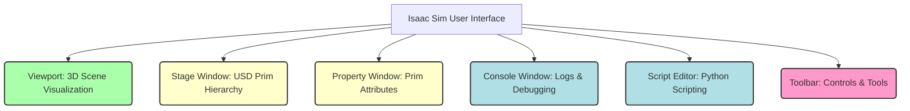

import Mermaid from '@theme/Mermaid';

## Learning Outcomes

After completing this section, you will be able to:
- Understand the core capabilities and advantages of NVIDIA Isaac Sim as a leading robotics simulation platform.
- Describe the key features that distinguish Isaac Sim, including photorealistic rendering, accurate physics, domain randomization, and its foundation on NVIDIA Omniverse.
- Explain the architectural relationship between Isaac Sim and the NVIDIA Omniverse platform, including USD and Nucleus.
- Successfully install and launch Isaac Sim on your development machine.
- Effectively navigate and utilize the primary components of the Isaac Sim user interface for scene creation and simulation management.
- Appreciate why Isaac Sim is particularly well-suited for the demanding requirements of humanoid robotics research and development.

## 1. What is Isaac Sim?

NVIDIA Isaac Sim is an extensible, **photorealistic, physics-based robotics simulator** built on the **NVIDIA Omniverse** platform. It is specifically designed to accelerate the development, testing, and training of AI-based robots in highly realistic and scalable virtual environments. More than just a simulator, Isaac Sim is a powerful tool for synthetic data generation, digital twin creation, and the validation of complex robotic systems.

For **humanoid robotics**, Isaac Sim offers unparalleled advantages:
-   **Advanced Sensor Simulation:** Generate high-fidelity synthetic data for complex sensors like RGB-D cameras, LiDAR, and event cameras, crucial for training robust perception models for humanoids that operate in diverse environments.
-   **Realistic Physics for Dynamic Control:** Test and refine advanced control algorithms for dynamic balance, agile locomotion (walking, running), and dexterous manipulation with highly accurate physics (powered by NVIDIA PhysX 5). This is vital for developing humanoids that can move gracefully and safely.
-   **Large-Scale Data Generation:** Leverage features like domain randomization and a high-performance simulation backend to generate vast datasets for training deep learning models (e.g., for perception, reinforcement learning) that are robust to real-world variations.
-   **Human-Robot Interaction (HRI) Scenarios:** Create and test realistic HRI scenarios with virtual humans, understanding complex social cues and ensuring safe interaction before deploying to physical humanoids.
-   **Digital Twin Capabilities:** Build accurate digital replicas of physical humanoid robots and their operating environments, enabling continuous testing, optimization, and remote operation.

Isaac Sim provides a cutting-edge platform for pushing the boundaries of humanoid robotics.

## 2. Key Features of Isaac Sim

Isaac Sim stands out with a suite of powerful features tailored for advanced robotics development:

-   **Photorealistic Rendering:** Utilizes **real-time ray tracing** (NVIDIA RTX technology) to produce stunningly realistic visuals. This is critical for generating synthetic sensor data that closely matches real-world camera images, making AI models trained in simulation more easily transferable to real robots (sim-to-real transfer).
-   **Accurate Physics:** Powered by the high-performance **NVIDIA PhysX 5** physics engine. This ensures precise simulation of rigid body dynamics, joint constraints, contacts, and complex material properties, which is essential for developing stable and dynamic humanoid locomotion and manipulation.
-   **Domain Randomization:** A powerful technique that automatically randomizes various simulation parameters (e.g., lighting, textures, material properties, object positions, camera viewpoints) within defined ranges. This creates a large and diverse dataset, helping to improve the robustness and generalization capabilities of AI models trained entirely in simulation.
-   **ROS/ROS 2 Integration:** Built-in, high-performance support for both ROS (Robot Operating System) and ROS 2, leveraging a dedicated ROS Bridge. This enables seamless integration with existing robotics software workflows, allowing users to send commands to simulated robots and receive sensor data as standard ROS messages.
-   **Synthetic Data Generation (SDG):** Beyond just rendering, Isaac Sim provides advanced tools for programmatically generating labeled synthetic data, including ground truth information (e.g., object poses, semantic segmentation, bounding boxes) that is impossible or very costly to obtain from real sensors. This data is invaluable for training supervised learning models.
-   **Scalability:** Can simulate complex environments and multiple robots simultaneously, and can be run headless (without a GUI) on remote servers or in the cloud for large-scale training and testing.
-   **USD (Universal Scene Description):** Isaac Sim leverages USD as its core scene description format. USD is an open-source, extensible framework developed by Pixar for robustly describing, composing, simulating, and collaborating on 3D scenes. This makes Isaac Sim highly extensible and interoperable.

:::tip Diagram Suggestion: Isaac Sim Architecture
A conceptual diagram showing Isaac Sim built on Omniverse, highlighting its core components and connections to physics, rendering, and ROS 2.

```mermaid
graph TD
    subgraph NVIDIA Omniverse Platform
        Nucleus(Nucleus: Database & Collaboration);
        Connectors(Connectors: DCC Apps, USD, ROS);
        RTXRenderer(RTX Renderer: Real-time Ray Tracing);
        PhysX5(PhysX 5: Physics Engine);
    end

    IsaacSim[NVIDIA Isaac Sim] --> Nucleus;
    IsaacSim --> Connectors;
    IsaacSim --> RTXRenderer;
    IsaacSim --> PhysX5;

    IsaacSim -- Utilizes --> USD(Universal Scene Description);
    IsaacSim -- Integrates --> ROS2[ROS 2 Network (via ROS Bridge)];
    
    style IsaacSim fill:#b0e0e6,stroke:#333,stroke-width:2px
    style Nucleus fill:#ffffcc,stroke:#333,stroke-width:2px
    style Connectors fill:#ffffcc,stroke:#333,stroke-width:2px
    style RTXRenderer fill:#ffffcc,stroke:#333,stroke-width:2px
    style PhysX5 fill:#ffffcc,stroke:#333,stroke-width:2px
    style USD fill:#aaffaa,stroke:#333,stroke-width:2px
    style ROS2 fill:#f9c,stroke:#333,stroke-width:2px
```

*This diagram illustrates how Isaac Sim is built upon the NVIDIA Omniverse platform, leveraging key components like Nucleus, RTX Renderer, PhysX 5, and USD, while also integrating with external systems like ROS 2.*
:::

## 3. Isaac Sim and NVIDIA Omniverse

Isaac Sim is not a standalone application; it is built on and extends **NVIDIA Omniverse**, a powerful and extensible platform for 3D design collaboration and scalable simulation. Omniverse's foundation provides Isaac Sim with many of its advanced capabilities:

-   **Universal Scene Description (USD):** At the heart of Omniverse is Pixar's USD format. USD is a high-performance, scalable 3D scene description technology that allows for robust interchangeability and non-destructive composition of assets from various applications. In Isaac Sim, everything is a USD prim, enabling powerful scene manipulation, layering, and extensibility.
-   **Omniverse Nucleus:** A database and collaboration engine that enables multiple users to work on the same 3D scene simultaneously, with changes synchronized in real-time. It also acts as a central repository for 3D assets.
-   **Omniverse Connectors:** Provide seamless interoperability with popular 3D applications (e.g., Blender, Autodesk Maya, CAD software) and other simulation platforms, allowing for easy import and export of assets.
-   **RTX Renderer:** Omniverse leverages NVIDIA's RTX technology for photorealistic, real-time ray-traced rendering, providing the visual fidelity seen in Isaac Sim.
-   **PhysX 5:** The high-fidelity physics engine provides accurate and stable simulation of rigid bodies, deformable bodies, and fluid dynamics within the Omniverse ecosystem.

This architecture enables Isaac Sim to deliver a powerful platform for developing robots where visual fidelity, physics accuracy, and collaborative workflows are paramount.

## 4. Installation and Launch

Installing Isaac Sim involves a few steps, primarily managed through the NVIDIA Omniverse Launcher.

### 4.1 Prerequisites:
-   **NVIDIA GPU:** An RTX-series GPU is highly recommended for optimal performance, though other NVIDIA GPUs may work.
-   **NVIDIA Drivers:** Latest NVIDIA GPU drivers installed.
-   **Operating System:** Typically Linux (Ubuntu 18.04/20.04/22.04 LTS) or Windows.

### 4.2 Installation Steps:

1.  **Download NVIDIA Omniverse Launcher:** Download and install the Omniverse Launcher from the [NVIDIA Omniverse website](https://www.nvidia.com/en-us/omniverse/download/).
2.  **Install Isaac Sim via Launcher:**
    *   Open the Omniverse Launcher.
    *   Navigate to the "Exchange" tab.
    *   Find "Isaac Sim" and click "Install." Choose your desired installation path.
    *   The launcher will download and install all necessary components, including the core Omniverse dependencies and the Isaac Sim application.
3.  **Setup Environment (for ROS 2 Integration):**
    After installation, you'll typically find an `isaac_sim` directory. Inside, there's usually a script to set up the environment, crucial for ROS 2.
    ```bash
    # Example path, adjust to your installation
    cd ~/.local/share/ov/pkg/isaac_sim-202X.X.X
    ./isaac_sim.sh # This often sets up environment variables and launches the app
    ```
    Alternatively, for a persistent ROS 2 environment, you might source a setup file and then launch `isaac_sim.sh` directly.

### 4.3 Launching Isaac Sim

Once installed, you can launch Isaac Sim through the Omniverse Launcher or via its `isaac_sim.sh` script.

**Launching from Omniverse Launcher:**
-   Go to the "Library" tab in the Omniverse Launcher.
-   Select "Isaac Sim" under "Installed Apps" and click "Launch."

**Launching from Terminal (for headless or scripting):**
```bash
cd ~/.local/share/ov/pkg/isaac_sim-202X.X.X # Navigate to your Isaac Sim installation
./python.sh ./usd/omni.isaac.sim.python.kit --headless # For headless mode
# or ./python.sh # then run Python scripts interactively
```
When launched, Isaac Sim will open its user interface, displaying a default empty stage or a sample environment.

## 5. The Isaac Sim User Interface

The Isaac Sim UI is a powerful and highly customizable interface built on Omniverse Kit. It provides a comprehensive suite of tools for designing, simulating, and analyzing robotic systems.

### Key UI Components:
-   **Viewport:** The main 3D rendering window where you visualize your scene, robots, and simulations. You can navigate it using standard 3D controls (orbit, pan, zoom).
-   **Stage Window:** A hierarchical tree view of all the USD prims (assets, models, lights, cameras, physics objects) in your current scene. It's similar to the "World Tree" in Gazebo. You can select, organize, and inspect entities here.
-   **Property Window (Details Panel):** Displays the properties and attributes of the currently selected USD prim from the Stage window. This allows you to modify parameters like position, scale, material properties, physics attributes, and sensor settings.
-   **Console Window:** Displays logs, errors, and output from scripts or simulation events.
-   **Script Editor:** An integrated Python editor for writing and executing Python scripts to control the simulation, create scenes, or automate tasks. This is a primary way to interact with Isaac Sim programmatically.
-   **Toolbar:** Provides quick access to common actions like play/pause simulation, adding primitive shapes, loading assets, and changing viewport settings.
-   **Extensions Window:** Manage and enable/disable various Isaac Sim extensions (e.g., `omni.isaac.ros2_bridge`, `omni.isaac.sensor`) that provide specific functionalities.

Navigating the UI involves selecting objects in the Viewport or Stage, then using the Property Window to adjust their attributes. The Script Editor and Console are vital for programmatic control and debugging.

:::tip Diagram Suggestion: Isaac Sim UI Layout
A simplified layout of the Isaac Sim GUI, highlighting its key panels and their functions.



*This diagram illustrates the main interactive components of the Isaac Sim user interface.*
:::

## 6. Exercises

1.  **Install Isaac Sim:** Follow the detailed installation steps outlined in Section 4 to successfully install NVIDIA Omniverse Launcher and Isaac Sim.
2.  **Launch and Explore:** Launch Isaac Sim and create a new empty stage. Navigate the 3D viewport using the mouse controls.
3.  **Add Primitives:** Use the toolbar or the "Create" menu to add a few primitive shapes (e.g., sphere, cube, cylinder) to your stage.
4.  **Inspect Properties:** Select one of the primitive shapes in the Viewport or the Stage window. Observe its properties (e.g., position, scale, material) in the Property Window. Change its position or color.
5.  **Run a Sample Scene:** Open one of the provided sample scenes in Isaac Sim (e.g., `Isaac/Samples/Articulations/Franka/franka_table.usd`). Run the simulation and observe the robot's behavior. Pause, step, and reset the simulation using the toolbar controls.
6.  **Script Editor Basics:** Open the Script Editor. Write a simple Python script to print "Hello Isaac Sim!" to the Console window. Then, try to write a script that programmatically adds a primitive cube to the stage at a specific coordinate. (Hint: Look for `omni.isaac.core.prims.XFormPrim` or `omni.isaac.core.utils.prims`).

## 7. Review Questions

1.  What is **NVIDIA Isaac Sim**, and what unique advantages does it offer for the development of **humanoid robotics**?
2.  Name and briefly describe three key features of Isaac Sim that contribute to its high-fidelity simulation capabilities.
3.  Explain the relationship between **Isaac Sim** and the **NVIDIA Omniverse** platform. What is the role of **USD (Universal Scene Description)** within this ecosystem?
4.  What are the primary hardware and software prerequisites for installing Isaac Sim?
5.  Describe how you would install Isaac Sim, mentioning the main tool used for its installation.
6.  Name three important windows or panels within the Isaac Sim user interface and briefly describe their function.
7.  Why is **domain randomization** a particularly valuable feature of Isaac Sim for training AI models for robots?
